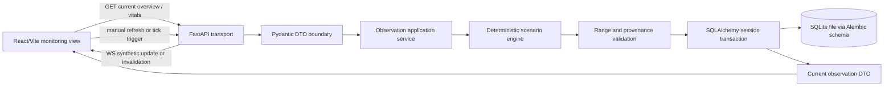

# Phase 1: Safety, Simulation, and Backend Contracts - Research

**Researched:** 2026-08-24
**Domain:** React/Vite frontend, FastAPI modular monolith, SQLAlchemy 2/Alembic, deterministic synthetic ICU monitoring
**Confidence:** MEDIUM

## User Constraints

- Phase 1 is limited to truthful provenance, deterministic P-1042 data, migration-backed persistence, and typed patient/vital monitoring contracts. [VERIFIED: .planning/ROADMAP.md:21-31]
- Live monitoring uses synthetic values approximately every 5-10 seconds, with manual refresh and configurable automatic refresh options. [VERIFIED: .planning/PROJECT.md:58-59]
- MIMIC-IV is retrospective research/training data only and must not be represented as a live bedside feed. [VERIFIED: .planning/PROJECT.md:5-7]
- This is a research prototype, not a clinically deployable medical device, and must not provide diagnosis or treatment advice. [VERIFIED: .planning/PROJECT.md:5-7; .planning/REQUIREMENTS.md:64]
- REST is authoritative; WebSockets are additive for synthetic updates or invalidation. [VERIFIED: .planning/STATE.md:21-22; .planning/REQUIREMENTS.md:60]

## Phase Requirements

| ID | Description | Research Support |
|----|-------------|------------------|
| DATA-01 | Seed P-1042 patient, ICU bed, nurse, admission, history, and configuration data. | Use one migration-owned schema plus idempotent seed/reset command and stable external identifier `P-1042`. |
| DATA-02 | Persist and display synthetic versus retrospective provenance. | Make provenance a required typed field on observation DTOs and separate runtime synthetic data from any future offline MIMIC workflow. |
| VITAL-01 | Expose bed, six required vitals, timestamp, and freshness. | Define a current-observation DTO with explicit units, observed time, received time, source, and freshness state. |
| VITAL-02 | Support deterministic approximately 5-10 second updates, manual refresh, and supported intervals. | Use logical ticks and an injected clock; timer cadence is configuration, not scenario truth. |
| VITAL-03 | Show simulated feed and stale/disconnected state honestly. | Use persistent prototype banner, source badges, freshness enum, and explicit disconnected state in API and UI state models. |
| SAFE-01 | Label prediction/context/alert/dispatch surfaces as research prototype and exclude diagnosis/treatment advice. | Centralize non-clinical copy and require it in relevant response/view models; Phase 1 establishes the label contract for later modules. |

## Summary

Phase 1 should establish a small, migration-backed vertical foundation rather than a broad hospital data model. The implementation should seed a fictional P-1042 journey, a bed, at least one nurse, admission/history context, and refresh/configuration values through a repeatable reset path. [VERIFIED: .planning/ROADMAP.md:21-31; .planning/REQUIREMENTS.md:15-22]

Use FastAPI transport DTOs backed by Pydantic models and SQLAlchemy persistence models kept separate from one another. Store immutable vital observations with a sequence/tick identifier and provenance instead of overwriting the current row; expose a current-view projection for the monitoring screen. [CITED: https://fastapi.tiangolo.com/tutorial/body/; https://docs.pydantic.dev/latest/concepts/models/; https://docs.sqlalchemy.org/en/20/orm/session_basics.html]

The simulator must be deterministic by logical scenario state. A seeded scenario should yield the same observation sequence for the same scenario version and tick inputs, while wall-clock scheduling merely decides when a tick is emitted. This permits tests to assert exact values without sleeping and keeps the browser timer from becoming the source of clinical-looking data. [ASSUMED]

**Primary recommendation:** Build one P-1042 observation service with file-backed SQLite, Alembic migrations, typed DTOs, immutable observations, an injected deterministic scenario clock, and required provenance/freshness/safety metadata on every monitoring response.

## Architectural Responsibility Map

| Capability | Primary Tier | Secondary Tier | Rationale |
|------------|-------------|----------------|-----------|
| Seed/reset, schema, and persistence | Database / Storage | API / Backend | Migration and seed state must be reproducible independently of the browser. |
| Scenario tick calculation | API / Backend | Database / Storage | The backend owns deterministic simulation and persists observations; the timer is only a trigger. |
| Current vitals and freshness calculation | API / Backend | Browser / Client | Server timestamps and source metadata are authoritative; the browser renders the resulting state. |
| REST DTO validation | API / Backend | Browser / Client | Pydantic validates inbound/outbound boundaries; TypeScript mirrors the public contract. |
| Automatic refresh and socket lifecycle | Browser / Client | API / Backend | The client controls subscription/poll cadence, while the backend emits only authorized synthetic updates. |
| Prototype labeling and provenance display | API / Backend | Browser / Client | The server prevents omission from responses; every relevant view renders the supplied metadata. |

## Standard Stack

### Core

| Library | Version observed 2026-08-24 | Purpose | Recommendation |
|---------|-----------------------------|---------|----------------|
| Python | 3.13.6 available locally | Backend runtime | Use the available interpreter unless package compatibility requires the project brief's Python 3.12 target. |
| FastAPI | 0.141.1 registry result | REST/WebSocket transport and dependency injection | Use; legitimacy tool flagged `SUS` because the release is very recent and downloads were unavailable. Human-verify before install. |
| Pydantic | 2.13.4 registry result | Typed request/response DTOs and boundary validation | Use; legitimacy tool flagged `SUS` because downloads were unavailable. Human-verify before install. |
| SQLAlchemy | 2.0.52 registry result | ORM and portable database boundary | Use SQLAlchemy 2-style `select()` and session scopes; legitimacy tool flagged `SUS` due recency/download signal. Human-verify before install. |
| Alembic | 1.19.1 registry result | Versioned schema migrations | Use from the first schema; legitimacy tool flagged `SUS` due recency/download signal. Human-verify before install. |
| SQLite | System SQLite 3.x | Zero-service local persistence | Use a file database, not an unshared in-memory database, for the reproducible demo. [CITED: https://docs.sqlalchemy.org/en/20/dialects/sqlite.html] |
| React | 19.2.8 npm registry result | Monitoring UI | Use with a typed client; legitimacy tool returned `OK`. |
| Vite | 8.2.2 npm registry result | React development/build tool | Use; Vite docs state Node.js 20.19+ or 22.12+ is required, and the local Node version is 24.11.0. Legitimacy tool flagged `SUS` due recency. [CITED: https://vite.dev/guide/] |

### Supporting

| Library | Version observed | Purpose | Recommendation |
|---------|------------------|---------|----------------|
| `@tanstack/react-query` | 5.102.2 | REST caching, invalidation, and refetch state | Use for authoritative REST reads; legitimacy tool flagged `SUS` due recency. |
| Vitest | 4.1.11 | Frontend unit/component tests | Use for DTO/state and monitoring behavior; legitimacy tool flagged `SUS` due recency. |
| `@testing-library/react` | 16.3.2 | User-visible component tests | Use; legitimacy tool returned `OK`. |
| Playwright | 1.62.1 | Later browser journey verification | Reserve primarily for Phase 5; legitimacy tool flagged `SUS` due recency. |
| Uvicorn | 0.52.4 | Local ASGI server | Use for local/demo execution; legitimacy tool flagged `SUS` due recency. |
| pytest | 9.1.1 | Backend tests | Use for simulator, seed, migration, and DTO checks; legitimacy tool flagged `SUS` because downloads were unavailable. |
| httpx | 0.28.1 | FastAPI test client and API checks | Use for endpoint tests; legitimacy tool flagged `SUS` because downloads were unavailable. |
| Ruff | 0.16.4 | Python lint/format checks | Use if adopted at bootstrap; legitimacy tool flagged `SUS` due recency. |

Versions above are registry observations, not durable pins. The package legitimacy audit is conservative: a `SUS` result means planner/executor must add a human verification checkpoint before installation. Package names with official documentation support should still be pinned in lockfiles. At bootstrap, run concrete checks for the selected packages: `python -m pip index versions fastapi`, `python -m pip index versions sqlalchemy`, `python -m pip index versions alembic`, `python -m pip index versions pydantic`, `python -m pip index versions uvicorn`, `python -m pip index versions pytest`, `python -m pip index versions httpx`, `npm view react version`, `npm view vite version`, `npm view vitest version`, `npm view @testing-library/react version`, and `npm view @tanstack/react-query version`; record non-blocking results in the implementation summary. [VERIFIED: npm/PyPI registry commands run 2026-08-24; package-legitimacy checks run 2026-08-24]

## Package Legitimacy Audit

| Package | Registry | Signal | Verdict | Disposition |
|---------|----------|--------|---------|-------------|
| `react` | npm | 170M weekly downloads, source repository | OK | Approved |
| `@testing-library/react` | npm | 54M weekly downloads, source repository | OK | Approved |
| FastAPI, SQLAlchemy, Alembic, Pydantic, `pydantic-settings`, Uvicorn, pytest, httpx, Ruff | PyPI | Existing source repositories; several recent releases or unknown downloads | SUS | Keep recommendation; human-verify before install |
| Vite, `@tanstack/react-query`, Vitest, Playwright | npm | Existing source repositories and high downloads; release recency triggered tool warning | SUS | Keep recommendation; human-verify before install |

No package received a `SLOP` verdict. No postinstall script was reported for the checked packages. This does not replace lockfile review, dependency pinning, or vulnerability scanning. [VERIFIED: package-legitimacy command output 2026-08-24]

## Architecture Patterns

### System Architecture Diagram



### Recommended Project Structure

```text
backend/
├── app/
│   ├── transport/       # FastAPI routes and response mapping
│   ├── contracts/       # Pydantic DTOs, enums, metadata shapes
│   ├── persistence/     # SQLAlchemy models, engine, session, repositories
│   ├── migrations/      # Alembic environment and revisions
│   ├── seed/            # Idempotent demo data and reset command
│   ├── vitals/          # Scenario clock, generator, observation service
│   └── safety/          # Provenance and prototype-label constants/policies
└── tests/               # unit, API, migration, and seed checks
frontend/
├── src/
│   ├── api/             # typed REST client
│   ├── contracts/       # TypeScript DTO mirror
│   ├── monitoring/      # current vitals, refresh, freshness state
│   └── safety/          # shared labels and source badges
└── tests/
```

The exact names are implementation choices; the boundary is the important part. Routes should not calculate scenario values, ORM models should not be returned directly, and React should not invent provenance or freshness. [CITED: https://docs.sqlalchemy.org/en/20/orm/session_basics.html; https://react.dev/reference/react/useEffect]

### Pattern 1: Immutable observation plus current projection

**What:** Every tick creates a `VitalObservation` record with patient identifier, sequence/tick, observed timestamp, received timestamp, typed vital values, source/provenance, scenario version, and freshness input. A current endpoint selects the latest valid observation and computes freshness against server time.

**When to use:** Always for the Phase 1 synthetic feed. It preserves replay/debug evidence and avoids a current-row update erasing the sequence that later prediction and audit phases need. [VERIFIED: .planning/research/ARCHITECTURE.md, Data Flow and Persistence Contracts]

**Suggested DTO shape:**

```python
class Provenance(BaseModel):
    source_kind: Literal["synthetic", "retrospective", "replay"]
    source_name: str
    scenario_id: str | None
    scenario_version: str | None
    is_live_bedside_feed: Literal[False]

class VitalObservation(BaseModel):
    patient_id: str
    bed_id: str
    sequence: int
    observed_at: datetime
    received_at: datetime
    spo2_percent: float
    heart_rate_bpm: float
    respiratory_rate_bpm: float
    systolic_bp_mmhg: float
    diastolic_bp_mmhg: float
    temperature_c: float
    provenance: Provenance
    freshness: Literal["fresh", "stale", "disconnected", "unavailable"]
    prototype_label: str
```

The literal values above mirror the project's required source vocabulary and freshness concepts; validate the final public enum spelling once implementation files exist. `is_live_bedside_feed` being false is a defensive contract field, not a claim that a client can override. [VERIFIED: .planning/REQUIREMENTS.md:15-22; .planning/research/ARCHITECTURE.md, Data Flow and Persistence Contracts]

### Pattern 2: Deterministic scenario engine with injected time

**What:** Keep scenario calculation pure: `(scenario_version, seed, tick_index, prior_state) -> observation values`. Use a fixed ordered fixture or seeded PRNG, explicit units, bounded ranges, and a reset operation that sets tick to zero. The scheduler sleeps approximately the configured interval, but tests call `advance(tick)` directly.

**When to use:** Use for the P-1042 deterioration path and manual simulation trigger. Do not use wall-clock time, random global state, or browser-generated values as scenario inputs. [ASSUMED]

**Verification design:** Assert that two fresh engines with the same version/seed produce byte-equivalent DTO values for ticks 0 through N; a different seed/version changes the sequence; reset reproduces tick 0; every value passes physiologic-range validation; and automatic scheduling emits no more than one observation per logical tick.

### Pattern 3: Explicit freshness policy

**What:** Return both `observed_at` and `received_at`, plus a server-computed freshness state. Suggested policy is configuration-driven: `fresh` within the allowed age, `stale` after that age, `disconnected` when the stream reports a transport failure, and `unavailable` when no observation exists or the scenario is disabled. Do not let the client infer currentness from render time alone. [VERIFIED: .planning/REQUIREMENTS.md:20-22, 60; .planning/ROADMAP.md:28-30]

**When to use:** Apply to REST current-vitals responses and WebSocket messages. The UI may show a local elapsed timer as supplemental detail, but the server state remains authoritative after refresh/reconnect.

### Pattern 4: REST-first, socket-additive monitoring

**What:** `GET /api/v1/patients/P-1042/vitals/current` is sufficient to recover state. A patient-scoped socket carries a typed event containing event type, patient ID, sequence, observed time, and either a compact observation or an invalidation marker. On connect, authorize scope, send a snapshot, and remove the connection on disconnect. [VERIFIED: .planning/STATE.md:21-22; .planning/REQUIREMENTS.md:60; CITED: https://fastapi.tiangolo.com/advanced/websockets/]

**Frontend rule:** Put socket/timer setup and cleanup in a custom hook. React's official guidance requires cleanup symmetry and complete dependencies; development Strict Mode may exercise setup/cleanup more than once. [CITED: https://react.dev/reference/react/useEffect]

## Don't Hand-Roll

| Problem | Don't Build | Use Instead | Why |
|---------|-------------|-------------|-----|
| Schema evolution | `create_all()` as the durable schema process | Alembic revisions with reviewed autogenerate output | Migration history must be auditable and SQLite changes may require table recreation. [CITED: https://alembic.sqlalchemy.org/en/latest/autogenerate.html; https://alembic.sqlalchemy.org/en/latest/batch.html] |
| DTO validation | Returning ORM objects or manually parsing dicts | Pydantic request/response models | Typed boundaries make missing provenance, units, and freshness fields visible. [CITED: https://docs.pydantic.dev/latest/concepts/models/] |
| REST cache/invalidation | Ad hoc fetch state in every component | TanStack Query | Centralizes loading/error/stale/refetch behavior; React docs identify client caches as an alternative to manual Effect fetching. [CITED: https://react.dev/reference/react/useEffect] |
| Database transaction ownership | Repositories that open/commit their own sessions | Application-owned session scope | SQLAlchemy recommends externally managed, short transaction scopes and one session per task. [CITED: https://docs.sqlalchemy.org/en/20/orm/session_basics.html] |
| Random scenario values | `random` calls scattered through routes/UI | One versioned deterministic scenario engine | Reproducible demonstration and exact tests require a stable input sequence. [ASSUMED] |
| Safety copy | Per-component warning strings | Shared required prototype-label contract | Prevents a later surface from omitting synthetic/non-clinical status. [VERIFIED: .planning/REQUIREMENTS.md:64; .planning/ROADMAP.md:30] |

## Common Pitfalls

### Pitfall 1: Seed data coupled to migration execution
**What goes wrong:** Re-running setup duplicates P-1042, changes the assigned bed/nurse, or silently leaves partial seed data. [ASSUMED]
**How to avoid:** Keep schema migrations separate from an idempotent seed/reset command. Upsert by stable external IDs, verify expected counts and relationships, and provide a destructive reset only when explicitly requested. [VERIFIED: .planning/REQUIREMENTS.md:15, 63]
**Warning signs:** Seed command succeeds twice but returns different IDs, or a clean database cannot reproduce the same overview.

### Pitfall 2: SQLite constraints are declared but inactive
**What goes wrong:** SQLite accepts invalid foreign-key references because enforcement is off by default. [CITED: https://docs.sqlalchemy.org/en/20/dialects/sqlite.html]
**How to avoid:** Emit `PRAGMA foreign_keys=ON` on every connection before use and test an invalid relationship insert. Name constraints so Alembic can target them during batch changes. [CITED: https://docs.sqlalchemy.org/en/20/dialects/sqlite.html; https://alembic.sqlalchemy.org/en/latest/batch.html]
**Warning signs:** Orphan observations, seed order not mattering, or migration tests passing only because invalid rows are accepted.

### Pitfall 3: Session sharing across simulator tasks
**What goes wrong:** A long-lived or shared AsyncSession produces state races, locks, and cross-tick transaction contamination. [CITED: https://docs.sqlalchemy.org/en/20/orm/session_basics.html]
**How to avoid:** Use one short-lived session per tick/request and never hold a database session for a WebSocket lifetime. Commit observation and related current-state updates within a clear transaction boundary.
**Warning signs:** `database is locked`, stale ORM values, or one failed tick rolling back another task's work.

### Pitfall 4: Alembic autogenerate treated as final
**What goes wrong:** Renames may appear as drop/add, unnamed constraints may be missed, and SQLite alterations may require batch move-and-copy. [CITED: https://alembic.sqlalchemy.org/en/latest/autogenerate.html; https://alembic.sqlalchemy.org/en/latest/batch.html]
**How to avoid:** Review every generated revision, use named constraints, configure batch rendering for SQLite, and run upgrade/downgrade checks against a disposable file database.
**Warning signs:** A migration deletes seeded data, produces an empty revision unexpectedly, or fails only after foreign keys are enabled.

### Pitfall 5: Browser timer presented as telemetry truth
**What goes wrong:** A tab pause, background throttling, or socket loss makes the UI look current while no new observation was received. [ASSUMED]
**How to avoid:** Distinguish observation time from receipt time, render server freshness and transport state, and refetch REST after reconnect or manual refresh. Keep the 5-10 second cadence as a configured demo behavior, not a clinical guarantee. [VERIFIED: .planning/PROJECT.md:58-59; .planning/REQUIREMENTS.md:21-22]

### Pitfall 6: Safety labeling added only to the landing shell
**What goes wrong:** A risk or monitoring card can be screenshotted without the simulated/non-clinical context. [VERIFIED: .planning/REQUIREMENTS.md:64; .planning/ROADMAP.md:30]
**How to avoid:** Include prototype label and provenance in the API contract, show them at the point of monitoring, and test rendered monitoring/error/fallback states for the required copy.
**Warning signs:** A component has a hard-coded clinical-sounding title, omits source metadata, or calls synthetic observations "live" or "bedside".

## Concrete Verification Commands and Tests

Nyquist validation is disabled in `.planning/config.json`, so these are recommended implementation checks rather than a formal phase validation matrix. [VERIFIED: .planning/config.json]

### Backend foundation

```powershell
cd backend
alembic upgrade head
alembic check
cd ..
pytest backend/tests/test_migrations.py backend/tests/test_seed.py -q
ruff check backend
```

Verify that a fresh SQLite file upgrades from an empty database, `alembic check` reports no uncommitted model drift, seed/reset is idempotent, `P-1042` has the required relationships, and invalid foreign keys fail. `alembic check` is an official command that reports whether new upgrade operations would be generated. [CITED: https://alembic.sqlalchemy.org/en/latest/autogenerate.html]

### Deterministic simulator and DTOs

```powershell
pytest backend/tests/test_scenario.py backend/tests/test_vital_contracts.py -q
pytest backend/tests/test_scenario.py -q -k "same_seed or reset or sequence"
```

Tests should compare two runs with the same seed/version/ticks, assert monotonic sequence and timestamps under the injected clock, validate required ranges/units, reject missing or non-synthetic Phase 1 observations, and verify freshness transitions using fixed `received_at` values rather than sleeps.

### API and monitoring smoke checks

```powershell
uvicorn backend.app.main:app --reload
# in another PowerShell session
Invoke-RestMethod http://127.0.0.1:8000/health
Invoke-RestMethod http://127.0.0.1:8000/api/v1/patients/P-1042/vitals/current
```

The checked-in `python scripts/phase1_smoke.py` command provides the deterministic automated API path: it starts and tears down Uvicorn, calls both endpoints, and asserts synthetic provenance and freshness.

The current-vitals response should contain the bed, all six required vital values, timestamps, `synthetic` provenance, a non-clinical prototype label, and an explicit freshness state. Once auth exists in Phase 2, the same smoke check must be protected; Phase 1 may use a development-only fixture or defer authenticated transport checks.

### Frontend checks

```powershell
npm run build
npm run test -- --run
npm run lint
```

Add component tests for initial loading, fresh data, stale data, disconnected socket, unavailable scenario, manual refresh, and supported interval selection. Use fake timers for client scheduling and mock REST/socket boundaries; do not wait real 5-10 second intervals in unit tests. React's Effect cleanup guidance makes socket close and timer clear behavior a required test assertion. [CITED: https://react.dev/reference/react/useEffect]

## Environment Availability

| Dependency | Required By | Available | Version | Fallback |
|------------|-------------|-----------|---------|----------|
| Python | FastAPI/backend | Yes | 3.13.6 | Use project-targeted 3.12 if compatibility testing requires it |
| Node.js | Vite/frontend | Yes | 24.11.0 | None needed; Vite requires 20.19+ or 22.12+ [CITED: https://vite.dev/guide/] |
| npm | frontend packages | Yes | 11.6.1 | None |
| SQLite CLI | migration inspection | Not verified | -- | Python `sqlite3` module and SQLAlchemy inspection |
| PostgreSQL | migration portability | Not required for Phase 1 | -- | SQLite-first; add a later integration profile |
| Context7 MCP | documentation seam | Not available as a callable tool in this session | -- | Official documentation fetches used directly |

## Security Domain

Phase 1 has no login implementation, but security enforcement remains enabled by default and the data boundary is safety-sensitive. [VERIFIED: .planning/config.json; .planning/REQUIREMENTS.md:15-22, 64]

| ASVS Category | Applies | Phase 1 control |
|---------------|---------|-----------------|
| V2 Authentication | Deferred | Do not claim Phase 1 endpoints are authenticated; Phase 2 owns JWT. |
| V3 Session Management | Deferred | No browser session contract is established here. |
| V4 Access Control | Yes, boundary preparation | Keep patient identifiers and route shapes ready for server-side checks; do not rely on hidden UI. |
| V5 Input Validation | Yes | Pydantic validates patient IDs, enum/provenance values, vital ranges, timestamps, and refresh interval bounds. |
| V6 Cryptography | Deferred | No cryptography in Phase 1; do not create secrets or tokens in seed data. |
| V7 Error and Logging | Yes | Do not include credentials or sensitive payloads in errors; make invalid provenance and malformed observations observable without leaking data. |

Known threat patterns include tampered patient IDs, forged provenance, out-of-range vital values, oversized WebSocket messages, and resource exhaustion through unbounded tick requests. Mitigate with server-owned provenance, bounded request/message sizes, range validation, bounded simulation advancement, and later shared authorization policy. [CITED: https://cheatsheetseries.owasp.org/cheatsheets/Authorization_Cheat_Sheet.html; https://cheatsheetseries.owasp.org/cheatsheets/Logging_Cheat_Sheet.html]

## State of the Art

| Old approach | Current approach | Impact |
|--------------|------------------|--------|
| SQLAlchemy legacy `Query` style | SQLAlchemy 2-style `select()` and typed sessions | Keep repository queries aligned with current documentation. [CITED: https://docs.sqlalchemy.org/en/20/orm/session_basics.html] |
| `create_all()` as deployment schema | Alembic revision history plus reviewed autogenerate | Schema drift becomes inspectable and repeatable. [CITED: https://alembic.sqlalchemy.org/en/latest/autogenerate.html] |
| WebSocket as source of truth | REST authoritative, socket additive | Reconnect and reload can recover from dropped messages. [VERIFIED: .planning/REQUIREMENTS.md:60] |
| Random timer-generated demo data | Versioned deterministic logical ticks | Tests and mentor demonstrations are reproducible. [ASSUMED] |

## Resolved Phase 1 Decisions

| Question | Decision | Status |
|---|---|---|
| Exact P-1042 scenario values and progression | Use scenario `p1042-deterioration-v1`, seed `p1042-demo`, and five deterministic logical ticks. Tick 0 is `SpO2 98, HR 82, RR 16, BP 122/78, Temp 36.8`; tick 1 is `97, 88, 18, 118/76, 36.9`; tick 2 is `95, 96, 22, 112/72, 37.1`; tick 3 is `92, 108, 27, 104/68, 37.4`; tick 4 is `88, 122, 32, 96/62, 37.8`. These fictional values are demonstrations, not clinical recommendations. | RESOLVED |
| Freshness thresholds | Server freshness is `fresh` at receipt age <= 15 seconds, `stale` above 15 and <= 60 seconds, `disconnected` on transport failure, and `unavailable` when no observation exists or simulation is disabled. | RESOLVED |
| Supported interval options | The typed configuration contract exposes 5, 10, and 30 second automatic intervals plus `manual`; default is 10 seconds. The browser timer only triggers an authoritative REST advance/read operation. | RESOLVED |
| Phase 1 access | Public read-only synthetic monitoring and health/configuration reads are allowed for the local research prototype. The bounded synthetic advance/write operation is a development fixture operation, not a general public mutation; JWT protection and authenticated mutations are deferred to Phase 2+. | RESOLVED |

These decisions are the source of truth for all Phase 1 plans.

## Assumptions Log

| # | Claim | Section | Risk if Wrong |
|---|-------|---------|---------------|
| A1 | A fixed seed/version/tick deterministic engine is the best Phase 1 simulation strategy. | Summary, Architecture | Later prediction or demo tests may need a different scenario representation. |
| A2 | The suggested freshness enum spelling (`fresh`, `stale`, `disconnected`, `unavailable`) will be acceptable to the public contract. | Pattern 1/3 | Cross-phase DTO compatibility could require renaming before Phase 2/3. |
| A3 | Phase 1 read-only synthetic monitoring is intentionally public for local prototype viewing; the bounded advance fixture is not an authenticated production contract. | Resolved Phase 1 Decisions | Phase 2 must replace this development access seam with JWT and server-side authorization. |
| A4 | Current registry versions are suitable pins after human verification. | Standard Stack | Very recent releases may have compatibility or legitimacy concerns despite existing source repositories. |
| A5 | Exact P-1042 values, freshness thresholds, interval options, and Phase 1 access were open during initial research. | Resolved Phase 1 Decisions | The five-tick values, 15/60-second policy, 5/10/30/manual intervals, and public read-only scope above govern implementation. |

## Open Questions

1. **How should retrospective MIMIC-IV provenance be represented before v2?** Define the DTO vocabulary now, but keep no MIMIC rows in the runtime seed and no import path in the Phase 1 live simulator. [VERIFIED: .planning/PROJECT.md:7; .planning/REQUIREMENTS.md:71]

## Sources

### Primary / authoritative

- [PROJECT.md](../../PROJECT.md) - project scope, safety constraints, SQLite-first decision, refresh behavior, and MIMIC-IV boundary.
- [REQUIREMENTS.md](../../REQUIREMENTS.md) - Phase 1 requirement IDs, required vitals, provenance, safety labeling, and reset expectations.
- [ROADMAP.md](../../ROADMAP.md) - Phase 1 goal, success criteria, and phase boundaries.
- [STATE.md](../../STATE.md) - current phase scope and unresolved P-1042 details.
- [ARCHITECTURE.md](../../research/ARCHITECTURE.md) - modular-monolith boundaries and persistence contracts.

### Official documentation

- [SQLAlchemy Session Basics](https://docs.sqlalchemy.org/en/20/orm/session_basics.html) - session lifetime, transaction scope, 2.0 queries, and task safety.
- [SQLAlchemy SQLite Dialect](https://docs.sqlalchemy.org/en/20/dialects/sqlite.html) - foreign-key enforcement, transaction behavior, file/in-memory pooling, and SQLite types.
- [Alembic Autogenerate](https://alembic.sqlalchemy.org/en/latest/autogenerate.html) - manual review, detection limits, and `alembic check`.
- [Alembic Batch Migrations](https://alembic.sqlalchemy.org/en/latest/batch.html) - SQLite move-and-copy and constraint caveats.
- [React `useEffect`](https://react.dev/reference/react/useEffect) - external-system setup/cleanup and dependency rules.
- [Vite Getting Started](https://vite.dev/guide/) - current Vite workflow and Node compatibility.
- [FastAPI body models](https://fastapi.tiangolo.com/tutorial/body/) and [WebSockets](https://fastapi.tiangolo.com/advanced/websockets/) - typed transport and connection lifecycle.
- [Pydantic models](https://docs.pydantic.dev/latest/concepts/models/) - typed model boundary.
- [OWASP Authorization Cheat Sheet](https://cheatsheetseries.owasp.org/cheatsheets/Authorization_Cheat_Sheet.html) and [Logging Cheat Sheet](https://cheatsheetseries.owasp.org/cheatsheets/Logging_Cheat_Sheet.html) - deny-by-default and safe observability principles.

### Tertiary / low confidence

- Web-only deterministic simulation and prototype-labeling searches were not extractable as authoritative sources in this session. Their recommendations are marked `[ASSUMED]`; project documents remain the source of truth for safety requirements.

## Metadata

**Confidence breakdown:**
- Standard stack: MEDIUM - official documentation supports the selected ecosystem, but current package pins and legitimacy signals need bootstrap-time human verification.
- Architecture: HIGH for modular monolith, REST-first, SQLAlchemy/Alembic boundaries; MEDIUM for the exact scenario implementation because no application code exists.
- Pitfalls: MEDIUM - persistence and React lifecycle pitfalls are documented; exact freshness and P-1042 behavior remain open.
- Safety: HIGH for project-specific labeling and synthetic/MIMIC separation; LOW for supplemental web-only prototype-labeling research.

**Research date:** 2026-08-24
**Valid until:** 2026-09-23 for stable architecture guidance; recheck package versions and legitimacy at bootstrap.
