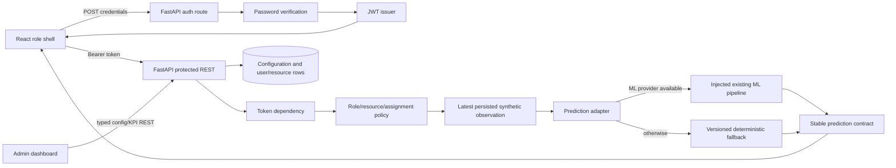

# Phase 2: Identity, Authorization, and Prediction Adapter - Research

**Researched:** 2026-08-24  
**Domain:** FastAPI JWT identity, server-side authorization, React role dashboards, stable prediction contracts  
**Confidence:** MEDIUM

## User Constraints

- Exactly three roles are in scope: Admin, Doctor, and Nurse. Unknown or additional roles must not access protected behavior. [VERIFIED: .planning/REQUIREMENTS.md:10-12; quote: "The system supports exactly three roles: Admin, Doctor, and Nurse; unknown or additional roles cannot access protected application behavior."] The demo seed contains exactly three accounts: Admin, Doctor, and assigned Nurse Sarah. The unassigned Nurse needed to prove AUTH-03 is a deterministic test-only persisted fixture, excluded from demo seed and demo account counts.
- API authorization must enforce role, resource, patient, and assignment permissions; hidden navigation is not authorization. [VERIFIED: .planning/REQUIREMENTS.md:12; quote: "The API enforces role and resource permissions server-side, including patient and assignment ownership; hidden navigation alone is not treated as authorization."]
- REST remains authoritative; WebSockets are additive only. [VERIFIED: .planning/STATE.md:21-22; quote: "REST remains authoritative; WebSockets are additive for synthetic updates and invalidation events."]
- The live feed is synthetic ICU research data; MIMIC-IV is retrospective research/training data only. [VERIFIED: .planning/PROJECT.md:5-7; quote: "The live dashboard uses simulated real-time vitals. MIMIC-IV is retrospective research/training data only and is not treated as a live bedside feed."]
- The product is a research prototype and must not provide diagnosis or treatment advice. [VERIFIED: .planning/REQUIREMENTS.md:64; quote: "User-facing prediction, contextual risk, alert, and dispatch surfaces clearly state that AcuityNet is a research prototype using simulated ICU data and do not provide diagnosis or treatment advice."]
- Phase 2 is scoped to AUTH-01 through AUTH-04, UI-01, PRED-01 through PRED-04, and ADMIN-01 through ADMIN-02. [VERIFIED: .planning/ROADMAP.md:49; quote: "Requirements: AUTH-01, AUTH-02, AUTH-03, AUTH-04, UI-01, PRED-01, PRED-02, PRED-03, PRED-04, ADMIN-01, ADMIN-02"]
- Deferred ideas including enterprise identity, tenancy, model evaluation views, and live integrations are out of scope. [VERIFIED: .planning/STATE.md:47-48; quote: "model evaluation views, MIMIC-IV cohort exploration, historical replay, global dispatch optimization, advanced alert policies, live integrations, enterprise identity, tenancy, and native mobile applications."]

## Phase Requirements

| ID | Description | Research support |
|----|-------------|------------------|
| AUTH-01 | Seeded Admin, Doctor, or Nurse login returns a JWT-backed session. | Add a seeded user table, password verification, login/token contracts, and a reusable bearer-token dependency. |
| AUTH-02 | Exactly Admin, Doctor, and Nurse roles are accepted. | Use a closed backend enum/literal and reject unknown role rows/claims before route execution. |
| AUTH-03 | Server-side role/resource/assignment authorization. | Centralize role policies and patient/assignment checks in backend dependencies/services; test direct API bypasses. |
| AUTH-04 | Logout and rejection of missing/invalid sessions. | Clear the browser token and enforce 401 on protected routes; use short-lived JWTs with explicit expiry. |
| UI-01 | Role-appropriate navigation and dashboards. | Add authenticated app shell and three bounded dashboard projections; the API remains the authority. |
| PRED-01 | Stable prediction payload. | Version a Pydantic prediction DTO and mirrored TypeScript type containing patient, bed, event, probability, score, level, horizon, timestamp, provenance, and source metadata. |
| PRED-02 | ML when available, deterministic fallback otherwise. | Define an adapter protocol with optional ML implementation and a deterministic versioned fallback selected by capability, never by UI. |
| PRED-03 | Authorized Clinical Prognosticator view. | Add a protected prediction REST read and a role-aware prediction view using current server vitals. |
| PRED-04 | Admin-editable prototype thresholds/configuration. | Replace ad hoc string reads with typed configuration validation and preserve research-rule/non-clinical labels. |
| ADMIN-01 | Admin manages prototype users, nurse status, beds, refresh settings, thresholds, and research rules. | Add explicit Admin-only endpoints and typed command DTOs; keep mutation logic in application services. |
| ADMIN-02 | Admin inspects operational KPIs and controls. | Add an Admin-only KPI read model with deterministic counts/status values and a typed response. |

## Summary

Phase 1 provides a synchronous FastAPI application factory, SQLAlchemy 2 persistence, Alembic schema ownership, seeded P-1042 data, immutable synthetic observations, server-owned freshness, and a React Query monitoring shell. [VERIFIED: .planning/codebase/ARCHITECTURE.md:4-21; .planning/phases/01-safety-simulation-and-backend-contracts/01-06-SUMMARY.md:31-48] No authentication or authorization layer exists yet, and the current endpoints are callable without a session. [VERIFIED: .planning/codebase/ARCHITECTURE.md:138-143; quote: "Authentication: No authentication or authorization layer is implemented yet"]

Build Phase 2 as a vertical identity-and-prediction slice: migrate users and assignment-capable resource relationships, seed exactly three roles, implement login/current-user/logout semantics, protect existing patient routes, then add the prediction adapter and Admin configuration/KPI read models. Keep REST handlers thin and put token validation, authorization decisions, prediction calculation, and typed configuration in backend modules adjacent to their owning responsibility. [VERIFIED: .planning/codebase/STRUCTURE.md:93-103; quote: "Primary backend use case: add the owning domain module under `backend/app/<feature>/`, then expose it through `backend/app/main.py`"]

The prediction adapter must consume the latest server observation and return a stable result regardless of whether an optional ML callable is available. In this repository no ML pipeline or ML dependency is currently detected. [VERIFIED: .planning/codebase/INTEGRATIONS.md:20-22; quote: "No vendor SDK, remote API client, OAuth client, device connector, or outbound HTTP integration is implemented."] Therefore Phase 2 should define an integration seam, not invent a model: a deterministic fallback is the executable default, while an explicitly injected ML provider may be used when present and must identify itself in the response. Every prediction response must carry the existing synthetic provenance and exact `PROTOTYPE_LABEL`. [VERIFIED: backend/app/safety/labels.py:1-3; quote: "PROTOTYPE_LABEL = \"Research prototype: simulated ICU data, not clinical advice.\""]

**Primary recommendation:** Add a migration-backed `User`/role foundation and centralized FastAPI bearer dependency/policy layer first; then expose a versioned prediction adapter whose deterministic fallback is always testable, followed by an authenticated React shell with Admin, Doctor, and Nurse views and Admin-only typed configuration/KPI routes.

## Architectural Responsibility Map

| Capability | Primary Tier | Secondary Tier | Rationale |
|---|---|---|---|
| Credential verification and JWT issuance | API / Backend | Browser / Client | The server verifies passwords, signs claims, and decides session validity; the browser only submits credentials and stores the session representation. |
| Role/resource/assignment policy | API / Backend | Database / Storage | Authorization must survive a UI bypass and must query ownership/assignment relationships before returning data or allowing mutation. |
| User, role, assignment, and configuration persistence | Database / Storage | API / Backend | Stable identities, closed roles, ownership, and Admin changes require migration-backed durable state. |
| Prediction calculation and source selection | API / Backend | Database / Storage | The adapter reads the authoritative latest observation and configuration and returns a server-created result with source metadata. |
| Dashboard composition and navigation | Browser / Client | API / Backend | The client renders the authenticated user's role projection; server endpoints still enforce all capabilities. |
| Safety/provenance labeling | API / Backend | Browser / Client | The backend must make metadata impossible to omit from prediction/configuration responses; React displays it at the point of use. |
| Admin KPI aggregation | API / Backend | Database / Storage | KPI definitions and counts must be based on server data, not client-derived dashboard arithmetic. |

## Evidence-Based Baseline

| Evidence | Finding | Planning consequence |
|---|---|---|
| `backend/app/main.py:21-44` | `create_app` runs migration/seed and closes over a session factory, clock, and observation service. [VERIFIED: source read this session; quote: `migrate_database(database_url)` and `observation_service = ObservationService(P1042Scenario())`] | Inject auth/policy/prediction services through the same factory seam so tests remain isolated; avoid global mutable auth state. |
| `backend/app/persistence/models.py:7-61` | Current schema has Patient, Bed, Admission, Nurse, History, Configuration, and VitalObservation, but no User or assignment model. [VERIFIED: source read this session; quote: `class Patient`, `class Bed`, `class Admission`, `class Nurse`, `class History`, `class Configuration`, `class VitalObservation`] | Add an Alembic revision and ORM rows for users and the minimum assignment/resource ownership needed by this phase. Do not modify schema through seed alone. |
| `backend/app/seed/demo_data.py:8-44` | Seed is idempotent and repairs stable fictional rows; current fixture has one nurse and three string configuration rows. [VERIFIED: source read this session; quote: `patient_id=\"P-1042\"`, `nurse_id` `\"N-SARAH\"`, and `\"freshness_fresh_seconds\": \"15\"`] | Extend the canonical seed with exactly three fixed demo accounts and typed configuration defaults without changing stable P-1042 identity; create the unassigned Nurse only in test or temporary-smoke setup. |
| `backend/app/contracts/vitals.py:45-66` | Current response includes synthetic provenance, freshness, and prototype label. [VERIFIED: source read this session; quote: `provenance: SyntheticProvenance`, `freshness: FreshnessState`, `prototype_label: str`] | Prediction DTO should reuse the same safety contract rather than duplicate unconstrained strings. |
| `frontend/src/main.tsx:1-14` | React Query is already provided at the application root. [VERIFIED: source read this session; quote: `const queryClient = new QueryClient()` and `<QueryClientProvider client={queryClient}>`] | Put current-user/session queries in the existing provider and invalidate protected queries on login/logout. |
| `frontend/src/api/client.ts:1-26` | Fetch wrapper has no bearer header and throws generic non-2xx errors. [VERIFIED: source read this session; quote: `fetch(..., init)` and `if (!response.ok) { throw new Error(...) }`] | Centralize token attachment and 401 handling in this wrapper; do not add authorization logic independently in pages. |
| `frontend/src/monitoring/MonitoringPage.tsx:36-62` | Monitoring advances then performs authoritative current GET. [VERIFIED: source read this session; quote: `await advanceVitals(...)` followed by `setCurrentObservation(await getCurrentVitals(...))`] | Preserve advance-then-REST-read ordering and make the existing page a Nurse/Doctor-authorized projection after auth. |

## Standard Stack

### Core

| Library | Version | Purpose | Why standard |
|---|---:|---|---|
| FastAPI | 0.141.1 | REST routes and dependency injection | Existing pinned backend framework. [VERIFIED: backend/pyproject.toml:4-10; quote: `fastapi==0.141.1`] FastAPI documents OAuth2 bearer dependencies and JWT patterns. [CITED: https://fastapi.tiangolo.com/tutorial/security/oauth2-jwt/] |
| SQLAlchemy | 2.0.52 | User/resource/configuration persistence | Existing pinned ORM and session boundary. [VERIFIED: backend/pyproject.toml:4-10; quote: `sqlalchemy==2.0.52`] |
| Alembic | 1.19.1 | User and configuration schema migration | Existing migration authority. [VERIFIED: backend/pyproject.toml:4-10; quote: `alembic==1.19.1`] |
| Pydantic | 2.13.4 | Auth, prediction, config, and KPI contracts | Existing DTO layer. [VERIFIED: backend/pyproject.toml:4-10; quote: `pydantic==2.13.4`] |
| React | 19.2.8 | Role dashboards and authenticated shell | Existing frontend runtime. [VERIFIED: frontend/package.json:13-15; quote: `\"react\": \"^19.2.8\"`] |
| TanStack Query | 5.102.2 | Current-user, prediction, and Admin query state | Existing server-state provider. [VERIFIED: frontend/package.json:13-15; quote: `\"@tanstack/react-query\": \"^5.102.2\"`] |

### Supporting

| Library | Version | Purpose | When to use |
|---|---:|---|---|
| `PyJWT` | 2.13.0 observed | JWT encode/decode with explicit algorithm and expiry | Use only for token signing/verification if the human verification checkpoint approves it. [VERIFIED: pip registry command 2026-08-24; quote: `PyJWT (2.13.0)`; [WARNING: local legitimacy gate verdict SUS because downloads were unavailable]] |
| Python `hashlib.scrypt` / `hmac.compare_digest` | Python 3.13 standard library | Seeded password hashing and constant-time verification | Use for this local fictional prototype to avoid adding a password-hashing dependency; store salt, parameters, and digest, never plaintext. [ASSUMED] |
| Vitest | 4.1.11 | Role shell and auth client tests | Existing frontend runner. [VERIFIED: frontend/package.json:22-25; quote: `\"vitest\": \"^4.1.11\"`] |
| pytest | 9.1.1 | Auth/policy/adapter API tests | Existing backend runner. [VERIFIED: backend/pyproject.toml:13; quote: `test = [\"pytest==9.1.1\"]`] |

### Alternatives Considered

| Instead of | Could use | Tradeoff |
|---|---|---|
| `PyJWT` plus FastAPI bearer dependency | `python-jose` | Avoid adding a second JWT ecosystem; use the already documented FastAPI/PyJWT pattern unless a compatibility check rejects it. [CITED: https://fastapi.tiangolo.com/tutorial/security/oauth2-jwt/] |
| Browser localStorage token | HttpOnly cookie session | Cookies improve token exposure posture but require CSRF protection and broader transport changes; for this local seeded prototype, use one documented short-lived bearer representation and do not call it production auth. [ASSUMED] |
| ML package in Phase 2 | Injected provider protocol | No ML pipeline exists in the repository; installing a model package would create unverified behavior and undermine deterministic tests. [VERIFIED: .planning/codebase/INTEGRATIONS.md:20-22] |
| Separate dashboard apps | One authenticated React shell with role projections | Reuses the existing `App` and React Query boundary while making the role difference explicit in navigation and data capabilities. [VERIFIED: frontend/src/App.tsx:1-17] |

**Installation:**

```powershell
python -m pip install "PyJWT==2.13.0"
```

This install requires a `checkpoint:human-verify` task because the package-legitimacy gate returned `SUS` for unknown download volume. Re-run the registry and legitimacy checks immediately before installation; do not install any ML dependency in this phase.

## Package Legitimacy Audit

| Package | Registry | Age | Downloads | Source Repo | Verdict | Disposition |
|---|---|---|---|---|---|---|
| `PyJWT` | PyPI | Published 2026-05-21 in local gate output | Unknown | github.com/jpadilla/pyjwt | SUS | Keep only behind human verification checkpoint; no postinstall script reported |

**Packages removed due to [SLOP] verdict:** none.  
**Packages flagged as suspicious [SUS]:** `PyJWT` — verify official project identity, release, and download signal before install.

## Architecture Patterns

### System Architecture Diagram



### Recommended Project Structure

```text
backend/app/
├── auth/             # password verification, JWT issuer, current-user dependency
├── authorization/    # closed roles and patient/assignment policy checks
├── predictions/      # adapter protocol, ML capability, deterministic fallback, service
├── admin/            # typed configuration/KPI application services and routes
├── contracts/        # auth, prediction, admin/config/KPI DTOs
├── persistence/      # User, assignment/resource models and repositories
├── migrations/       # next Alembic revision
└── seed/             # exactly three fictional accounts and canonical defaults
frontend/src/
├── auth/             # login/session state and client helpers
├── dashboards/       # role-specific projections
├── predictions/      # Clinical Prognosticator presentation
├── admin/             # Admin controls/KPIs
├── api/               # bearer-aware REST client
└── contracts/         # mirrored DTOs and closed role union
```

### Pattern 1: Dependency-level identity, policy-level authorization

**What:** Decode and validate the bearer token in one FastAPI dependency. Then apply a second dependency/service for role and resource checks. The token identifies the user; the database decides current role, patient visibility, nurse assignment, and Admin capability. [CITED: https://fastapi.tiangolo.com/tutorial/security/oauth2-jwt/]

**When to use:** Every protected route, including existing current-vitals and bounded advance routes. Never accept a role supplied in a request body as authorization.

**Example:**

```python
class Role(str, Enum):
    ADMIN = "Admin"
    DOCTOR = "Doctor"
    NURSE = "Nurse"


def require_roles(*allowed: Role):
    def dependency(current_user: User = Depends(get_current_user)) -> User:
        if current_user.role not in allowed:
            raise HTTPException(status_code=403, detail="Forbidden")
        return current_user
    return dependency
```

[ASSUMED] The exact helper signature is an implementation recommendation; preserve the closed values verbatim from the requirement: `Admin`, `Doctor`, `Nurse`. Resource checks must follow role checks and query the database in the same request transaction.

### Pattern 2: JWT claims are identity hints, not durable authorization

Issue a short-lived token containing a subject identifier, role snapshot, issued-at, and expiry, but reload the user from the database on each protected request. Reject missing, malformed, expired, disabled, or unknown-subject tokens with 401; reject authenticated but disallowed actions with 403. Logout clears the client token and optionally records token invalidation only if the implementation adds a server-side revocation mechanism. [CITED: https://fastapi.tiangolo.com/tutorial/security/oauth2-jwt/; [ASSUMED] status-code split and revocation choice]

### Pattern 3: Stable prediction adapter with explicit source

Define one adapter interface accepting a typed latest observation and configuration and returning a typed internal result. Attempt the injected ML provider only when it is available and its result validates. Otherwise calculate a pure deterministic fallback from the observation/configuration and set `source_kind` to a closed value such as `ml` or `deterministic_fallback`; include `model_version` or `rule_version` and an explicit `is_validated_clinical_output: false`. Do not silently fall back while reporting an ML source.

[ASSUMED] The exact score formula, risk levels, event wording, probability, and horizon are not present in Phase 1 and must be selected during planning as prototype rules. The fallback must be versioned and tested for repeated identical inputs, not presented as clinical calibration.

### Pattern 4: Admin configuration is typed at both edges

Read configuration rows through a typed settings object and validate every Admin write before persistence. Keep the existing stable keys as migration-compatible data where practical, but add explicit fields for prediction thresholds, fallback rule version, and refresh settings. Return the effective values plus prototype-label metadata so Admin can see that settings are research controls. [VERIFIED: backend/app/persistence/models.py:39-42; quote: `class Configuration(Base):` and `value: Mapped[str] = mapped_column(String(200), nullable=False)`]

### Pattern 5: Role dashboards are projections, not security boundaries

After login, fetch `/api/v1/auth/me` and render one shell with role-specific navigation: Admin sees controls and KPIs; Doctor sees monitoring and prediction read views; Nurse sees assigned work and authorized monitoring. The API must return 401/403 for direct calls to hidden routes. Keep the existing monitoring safety banner and server provenance visible on prediction and Admin configuration surfaces where risk-like values appear.

## Don't Hand-Roll

| Problem | Don't build | Use instead | Why |
|---|---|---|---|
| JWT parsing/signing | Custom base64/HMAC token format | `PyJWT` after legitimacy checkpoint plus explicit algorithm allowlist | JWT encoding, expiry, malformed claims, and algorithm handling have security edge cases. [CITED: https://fastapi.tiangolo.com/tutorial/security/oauth2-jwt/] |
| Password comparison | Plaintext or ordinary string equality | Salted `hashlib.scrypt` and `hmac.compare_digest`, or a human-approved password library | Password storage must resist offline guessing and timing leakage. [ASSUMED] |
| Authorization | UI-only hidden links or role strings in React | FastAPI dependency plus database-backed policy service | A caller can invoke REST directly; project requirement explicitly demands server enforcement. [VERIFIED: .planning/REQUIREMENTS.md:12] |
| Schema evolution | `create_all()` or seed-only columns | Reviewed Alembic revision and migration tests | Phase 1 explicitly separates migration from idempotent seed. [VERIFIED: .planning/STATE.md:23-25] |
| Prediction fallback | Random values, wall-clock behavior, or model-shaped placeholders | Pure versioned deterministic adapter | Reproducible demo and honest source metadata depend on stable inputs. [VERIFIED: .planning/STATE.md:25; quote: "deterministic fallback"] |
| Client server-state ownership | Separate fetch/cache logic in each role page | Existing TanStack Query provider and one bearer-aware client | Prevents inconsistent auth/error handling and supports invalidation after Admin writes. [VERIFIED: frontend/src/main.tsx:1-14] |

## Common Pitfalls

### Pitfall 1: Trusting the role claim forever
**What goes wrong:** A role changed or disabled in SQLite remains usable until token expiry, or a forged claim grants Admin behavior.  
**Why it happens:** Authorization is implemented as token parsing instead of current-user lookup.  
**How to avoid:** Verify signature/expiry, then load the subject from the database and enforce the closed role enum and active status.  
**Warning signs:** Tests pass when the request body or JWT role changes without a database update. [ASSUMED]

### Pitfall 2: Protecting navigation but leaving old routes public
**What goes wrong:** A hidden dashboard link disappears, but `GET /api/v1/patients/P-1042/vitals/current` or advance remains callable anonymously.  
**How to avoid:** Add auth dependencies to every protected existing route and direct API tests for missing, invalid, wrong-role, wrong-patient, and wrong-assignment access. [VERIFIED: .planning/codebase/CONCERNS.md:10-16]

### Pitfall 3: Ambiguous 401/403 behavior
**What goes wrong:** Clients cannot distinguish missing/invalid credentials from authenticated denial, and the UI treats authorization failure as a stale feed.  
**How to avoid:** Use 401 for absent/invalid/expired sessions and 403 for valid sessions lacking capability; centralize frontend handling. [ASSUMED]

### Pitfall 4: Seeding plaintext demo passwords
**What goes wrong:** Repository, database, logs, or API responses expose credentials.  
**How to avoid:** Seed only salted password digests, keep credentials in a local setup document or test fixture, and never return password fields from `/me` or Admin user responses. [ASSUMED]

### Pitfall 5: Prediction source laundering
**What goes wrong:** A missing ML pipeline returns a fallback result labeled as a model prediction, or a model result is displayed as validated clinical output.  
**How to avoid:** Make `prediction_source`, `model_version`/`rule_version`, fallback status, provenance, and non-clinical label required fields; test both capability branches. [VERIFIED: .planning/REQUIREMENTS.md:27-30; quote: "uses the existing ML pipeline when available and a deterministic, clearly labeled fallback when it is unavailable"]

### Pitfall 6: Configuration strings drift from runtime behavior
**What goes wrong:** Admin changes a value that the prediction or refresh path ignores, or malformed values silently become defaults.  
**How to avoid:** Define one typed configuration service, validate writes, return effective configuration, and test invalid values and persistence across a fresh app instance. [VERIFIED: .planning/codebase/CONCERNS.md:19-25]

### Pitfall 7: Leaking retrospective data into live contracts
**What goes wrong:** A prediction or dashboard makes MIMIC-IV material look like the current synthetic bedside feed.  
**How to avoid:** Keep Phase 2 adapter input synthetic-only, require the Phase 1 provenance shape, and reserve retrospective source kinds for a later isolated research flow. [VERIFIED: .planning/PROJECT.md:5-7]

### Pitfall 8: Admin KPI arithmetic in the browser
**What goes wrong:** Counts disagree across users or omit server-side state, especially after configuration or observation changes.  
**How to avoid:** Define KPI queries and status semantics on the backend and expose one typed Admin-only read model. [ASSUMED]

## Recommended Sequencing

1. **Schema and seed foundation:** Add the next Alembic revision for users, closed roles, active status, and the minimum nurse assignment/resource relationship; extend idempotent seed with exactly one fictional Admin, Doctor, and Nurse and hashed passwords. Preserve Phase 1 stable IDs and reset ordering.
2. **Auth contracts and service:** Add login request/response, current-user, logout behavior, password verification, JWT issue/decode, explicit secret/configuration injection, expiry, and 401 handling. Add backend tests before route wiring.
3. **Central policy and existing-route protection:** Add `get_current_user`, role guards, patient/resource checks, and assignment checks. Protect current vitals, bounded advance, prediction, and Admin routes. Decide explicitly which read operations Doctor/Nurse/Admin may access; do not infer policy from UI.
4. **Prediction adapter:** Define the stable Pydantic/TypeScript prediction contract, deterministic fallback rule/version, optional ML provider protocol, source-selection logic, and protected prediction GET. Require latest observation and return unavailable state when no observation exists rather than inventing one.
5. **Typed Admin configuration/KPIs:** Implement Admin-only configuration reads/writes and KPI aggregation. Validate refresh intervals and threshold/rule values centrally; return effective settings and prototype metadata.
6. **Frontend session and role shell:** Make the shared API client attach the bearer token and convert 401 to session expiry; add login/logout, current-user query, role navigation, and role dashboards. Keep Doctor/Nurse monitoring views constrained and retain visible safety/provenance presentation.
7. **Focused verification and smoke updates:** Run backend auth/policy/prediction/config tests, frontend auth/dashboard/prediction tests, migration checks, and a seeded login smoke path. Do not broaden into alerts, lifecycle, historian, dispatch, or WebSockets, which belong to later phases.

## Testing Strategy

Nyquist validation is explicitly disabled in `.planning/config.json` (`"nyquist_validation": false`), so this section is a practical Phase 2 test map rather than a formal Nyquist gate. [VERIFIED: .planning/config.json:9-10; quote: `\"nyquist_validation\": false`]

| Requirement | Test type | Focused check |
|---|---|---|
| AUTH-01 | Backend integration | Seed each account; POST login; assert 200, bearer token, subject/current-user, and no password field. |
| AUTH-02 | Backend unit/integration | Parameterize exact `Admin`, `Doctor`, `Nurse`; reject unknown role seed/claim and malformed token claims. |
| AUTH-03 | Backend integration | Anonymous, wrong role, wrong patient, and the deterministic unassigned-Nurse test fixture calls to protected routes return denial; direct REST calls prove UI hiding is irrelevant. |
| AUTH-04 | Backend/frontend integration | Missing, invalid, and expired tokens return 401; logout clears client session and subsequent protected request is rejected. |
| UI-01 | Frontend component | Login each role and assert only the allowed dashboard/navigation projection is rendered; assert Admin controls absent for Doctor/Nurse. |
| PRED-01 | Backend contract | Assert all required fields, enum/literal source metadata, timestamp, provenance, and version fields serialize and reject missing/invalid values. |
| PRED-02 | Backend unit | Inject ML provider and assert ML source; inject no provider/failing provider and assert deterministic fallback source/rule version and identical output for identical input. |
| PRED-03 | Backend/frontend integration | Authorized role reads P-1042 prediction and Clinical Prognosticator renders risk/event/probability/horizon/current vitals and safety label. |
| PRED-04 | Backend integration | Admin valid update persists and changes effective settings; Doctor/Nurse and invalid values are rejected; response states prototype configuration. |
| ADMIN-01 | Backend integration | Admin can manage only scoped prototype resources/configuration; Doctor/Nurse receive 403 and no mutation occurs. |
| ADMIN-02 | Backend integration/frontend component | KPI response is server-derived, typed, Admin-only, and displays system status plus all required counts/rates without clinical interpretation. |

**Backend commands:**

```powershell
python -m pytest backend/tests/test_auth.py backend/tests/test_authorization.py backend/tests/test_predictions.py backend/tests/test_admin.py -q
python -m pytest backend/tests/test_migrations.py backend/tests/test_seed.py -q
```

**Frontend commands:**

```powershell
npm --prefix frontend run test -- --run
npm --prefix frontend run build
npm --prefix frontend run lint
```

**Wave 0 gaps:** New focused test modules (`test_auth.py`, `test_authorization.py`, `test_predictions.py`, `test_admin.py`) and colocated frontend auth/dashboard/prediction tests will be needed. Existing `backend/tests/test_vitals_api.py` must be updated because its anonymous calls encode the Phase 1 access decision; preserve its behavior only through authenticated fixtures after Phase 2. [VERIFIED: backend/tests/test_vitals_api.py:6-14; quote: `app = create_app(database_url...)` followed by direct `client.post(...)`]

## Security Domain

Authentication and authorization are enabled by the project requirements; this phase must treat all browser input, bearer tokens, patient IDs, role values, and Admin configuration values as untrusted.

### Applicable ASVS Categories

| ASVS Category | Applies | Standard control |
|---|---|---|
| V2 Authentication | yes | Password hashing, explicit login contract, fixed bearer verification, expiry, disabled-user rejection. |
| V3 Session Management | yes | Short-lived signed JWT, no sensitive claims, client logout/clear, consistent 401 behavior, configured secret. |
| V4 Access Control | yes | Server-side closed-role and resource/assignment policy dependencies on every protected route. |
| V5 Input Validation | yes | Pydantic `extra=forbid`, closed role/source literals, typed threshold/range validation, encoded path IDs. |
| V6 Cryptography | yes | Use a vetted JWT library and standard password KDF; explicit algorithm allowlist; never hand-roll cryptography. |
| V7 Error Handling and Logging | yes | Do not disclose whether a password or patient exists in login errors; keep denial details minimal and prepare audit events for Phase 3. |

### Known Threat Patterns

| Pattern | STRIDE | Standard mitigation |
|---|---|---|
| Forged or altered JWT | Spoofing/Tampering | Signature verification, fixed algorithm, expiry, subject lookup, secret outside source. |
| Role escalation | Elevation of privilege | Closed enum, current DB role lookup, route-level policy tests, never trust client role. |
| Cross-patient access | Information disclosure | Patient/resource query in policy service before response; return 403/404 according to one documented policy. |
| Nurse assignment bypass | Elevation of privilege | Assignment ownership check in the mutation/read service, not merely dashboard filtering. |
| Credential leakage | Information disclosure | Salted digests only, no password response fields, generic login failures, avoid committed secrets. |
| Admin config injection | Tampering | Typed allowlisted keys/ranges and transactional writes; reject unknown keys. |
| Prediction source confusion | Spoofing/repudiation | Server-created source/version/provenance fields and explicit fallback/ML branch tests. |

## Environment Availability

| Dependency | Required by | Available | Version | Fallback |
|---|---|---:|---:|---|
| Python | Backend auth/prediction | yes | 3.14 runtime was reported by local pip notice; project requires >=3.13 | Existing project runtime |
| FastAPI/SQLAlchemy/Pydantic/Alembic | API/schema | yes in project environment | Pinned Phase 1 versions | Existing stack |
| PyJWT | JWT signing | registry yes | 2.13.0 observed 2026-08-24 | Human verification required; do not substitute an unverified package |
| npm/frontend toolchain | Dashboards/tests | yes in repository setup | React 19.2.8, Vite 8.2.2, Vitest 4.1.11 | Existing stack |
| ML pipeline/service | Prediction ML branch | no repository integration detected | — | Deterministic fallback; injected provider protocol |
| PostgreSQL/Redis/external identity | Phase 2 | no, not required | — | SQLite and seeded local identity are in scope |

## Assumptions Log

| # | Claim | Section | Risk if wrong |
|---|---|---|---|
| A1 | Python standard-library `hashlib.scrypt` is sufficient for seeded local prototype password storage. | Standard Stack / Security | May require a reviewed password library or parameter tuning before implementation. |
| A2 | Browser bearer-token storage is acceptable for this local prototype when clearly documented and short-lived. | Alternatives / Security | A cookie-based session plus CSRF control may be required by stakeholder policy. |
| A3 | The fallback score formula, event wording, probability, horizon, and risk-level boundaries can be selected as prototype rules in Phase 2. | Prediction adapter | Requirements may require exact values or domain review before planning. |
| A4 | 401 for invalid identity and 403 for valid-but-forbidden access is the desired API convention. | Auth patterns / Testing | Client and test contracts would need adjustment if the project chooses another convention. |
| A5 | KPI definitions can be implemented from the current single-patient/single-nurse schema and later expanded. | Admin | Some required KPIs may need additional persisted entities before meaningful values exist. |

## Open Questions

**Status: RESOLVED on 2026-08-24.** The following decisions are explicit planning inputs for Phase 2.

1. **Seeded development credentials: RESOLVED.** Seed exactly these three fictional local accounts, hash passwords during seeding, and document them in the README development setup only: `admin@acuitynet.local` / `AcuityNet-Admin-2026!`, `doctor@acuitynet.local` / `AcuityNet-Doctor-2026!`, and `nurse@acuitynet.local` / `AcuityNet-Nurse-2026!`. The unassigned Nurse used by AUTH-03 is a deterministic test-only persisted fixture, never created by `seed_demo_data` and excluded from demo account counts: `U-NURSE-UNASSIGNED`, `nurse-unassigned@test.local`, `AcuityNet-Unassigned-Nurse-Test-2026!`. The smoke runner creates that fixture only in its temporary database after demo seed, uses the same deterministic value without printing passwords or tokens, and no credential is returned by an API.
2. **Fallback rule and thresholds: RESOLVED.** Use a versioned deterministic prototype rule based on named current-vital deltas and bounded score/probability outputs. Store configurable research thresholds and rule version in typed configuration; identical observation/configuration inputs must produce identical output. These values are research controls, not clinical calibration or advice.
3. **Read and advance permissions: RESOLVED.** `Admin`, `Doctor`, and an assigned in-scope `Nurse` may read current vitals and predictions only after authentication and resource/assignment checks. The bounded fixture advance is `Admin`-only; an unassigned Nurse, Doctor, and anonymous caller cannot advance it. The smoke path and policy tests must prove these exact outcomes.
4. **KPI availability: RESOLVED.** Return typed KPI values with status `known`, `zero`, or `not_yet_available`; use real persisted counts where Phase 2 owns the data and use zero only when the domain definition genuinely yields zero. Do not fabricate alert, response-time, or acknowledgement metrics before their owning entities exist.

## Sources

### Primary (HIGH confidence)

- Repository source read this session: `backend/app/main.py`, `backend/app/persistence/models.py`, `backend/app/seed/demo_data.py`, `backend/app/contracts/vitals.py`, `backend/app/safety/labels.py`, `frontend/src/App.tsx`, `frontend/src/api/client.ts`, `frontend/src/main.tsx`.
- Repository planning source read this session: `.planning/STATE.md`, `.planning/ROADMAP.md`, `.planning/REQUIREMENTS.md`, `.planning/PROJECT.md`, `.planning/config.json`, Phase 1 plans/summaries, and `.planning/codebase/*.md`.
- FastAPI official OAuth2/JWT documentation: https://fastapi.tiangolo.com/tutorial/security/oauth2-jwt/ [CITED]

### Secondary (MEDIUM confidence)

- PyJWT PyPI registry result: `PyJWT (2.13.0)` on 2026-08-24; local package-legitimacy verdict `SUS` due unknown downloads, with upstream `github.com/jpadilla/pyjwt`. [VERIFIED: local registry/tool output]
- Pydantic model documentation: https://docs.pydantic.dev/latest/concepts/models/ [CITED]
- SQLAlchemy session documentation: https://docs.sqlalchemy.org/en/20/orm/session_basics.html [CITED]

### Tertiary (LOW confidence)

- Password storage, bearer storage, status-code convention, KPI projection details, and fallback scoring choices marked `[ASSUMED]` require confirmation during planning.

## Metadata

**Confidence breakdown:**
- Standard stack: MEDIUM - Phase 1 pins are repository-verified; PyJWT registry/version is verified but legitimacy is SUS pending human review.
- Architecture: MEDIUM - existing boundaries are directly verified, but Phase 2 resource/assignment scope and prediction formula are not yet implemented.
- Pitfalls: MEDIUM - authorization and safety risks are directly recorded in the codebase map; storage and token policy details include explicit assumptions.

**Research date:** 2026-08-24  
**Valid until:** 2026-09-23 for stable repository architecture; recheck package versions and legitimacy before installation.
