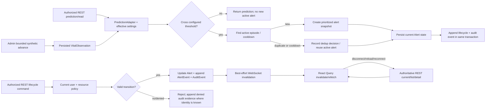

# Phase 3: Monitoring, Alerts, Lifecycle, and Audit - Research

**Researched:** 2026-08-24
**Domain:** Synthetic monitoring alert generation, lifecycle state, audit evidence, REST/WebSocket recovery
**Confidence:** MEDIUM

## User Constraints

No Phase 3 CONTEXT.md was present. The following project constraints are locked by the project sources:

- REST remains authoritative; WebSockets are additive for synthetic updates and invalidation events. [VERIFIED: .planning/STATE.md:21-22; quote: "REST remains authoritative; WebSockets are additive for synthetic updates and invalidation events."]
- The live dashboard uses simulated real-time vitals and MIMIC-IV is retrospective research/training data only. [VERIFIED: .planning/PROJECT.md:5-7; quote: "The live dashboard uses simulated real-time vitals. MIMIC-IV is retrospective research/training data only and is not treated as a live bedside feed."]
- The system is a research prototype and must not provide diagnosis or treatment advice. [VERIFIED: .planning/REQUIREMENTS.md:64; quote: "User-facing prediction, contextual risk, alert, and dispatch surfaces clearly state that AcuityNet is a research prototype using simulated ICU data and do not provide diagnosis or treatment advice."]
- Exactly three roles are in scope: Admin, Doctor, and Nurse. [VERIFIED: .planning/REQUIREMENTS.md:10-12; quote: "The system supports exactly three roles: Admin, Doctor, and Nurse; unknown or additional roles cannot access protected application behavior."]
- Phase 4 owns historian, dispatch, and nurse workflow requirements; Phase 3 must establish alert evidence without implementing autonomous or human-confirmed dispatch. [VERIFIED: .planning/REQUIREMENTS.md:44-60; quote: "Medical Context and Clinical Review" and "Tactical Dispatch and Nurse Workflow"; VERIFIED: .planning/ROADMAP.md:113-129; quote: "Phase 4: Medical Historian and Human-Confirmed Dispatch"]
- Out of scope for v1 are live bedside integration, clinical deployment, validated clinical risk weights, autonomous nurse dispatch, roles beyond the three listed roles, and global optimization. [VERIFIED: .planning/REQUIREMENTS.md:73-85; quote: "Live bedside device integration"; "Clinical diagnosis or treatment recommendations"; "Autonomous nurse dispatch"; "Roles beyond Admin, Doctor, and Nurse"]

## Phase Requirements

| ID | Description | Research support |
|----|-------------|------------------|
| ALRT-01 | Threshold crossing creates a prioritized alert with patient, bed, risk, event, probability, horizon, and provenance. | Consume the server prediction response from `PredictionAdapter` and persist a snapshot-backed alert contract with explicit source/prototype metadata. |
| ALRT-02 | Duplicate alert storms are prevented for an active deterioration episode using configurable deduplication or cooldown behavior. | Define a database-enforced active episode key plus a configurable cooldown/re-arm policy; make suppressed/reused outcomes observable. |
| ALRT-03 | Validated lifecycle transitions run from generated through dispatched/assigned, acknowledged, responded, and resolved; invalid/unauthorized transitions are rejected. | Centralize transition validation in an alert service and keep current state plus append-only events transactionally consistent. |
| ALRT-04 | Each transition records actor, timestamp, resulting state, and outcome data. | Persist immutable lifecycle events with actor identity and structured outcome fields in the same transaction as state mutation. |
| ALRT-05 | Authorized users inspect current alert state and ordered lifecycle evidence for P-1042. | Add protected REST list/detail/event endpoints and a role-scoped UI projection. |
| AUDT-01 | Important authenticated actions, assignments, configuration changes, alert actions, denied access, and lifecycle transitions appear in ordered audit view. | Use one append-only audit event model/service for security-relevant actions, including denied requests, with deterministic ordering. |
| REAL-01 | REST is authoritative; WebSockets deliver synthetic updates or invalidation; reconnect/reload recovers through REST. | Add a minimal authenticated WebSocket notification channel that never becomes a second read/mutation API; invalidate/refetch React Query keys on messages and reconnect. |
| REAL-02 | Loading, stale, disconnected, unavailable-fallback, and no-candidate states are honest and visible. | Extend typed operational-state contracts and UI branches; no-candidate belongs to the Phase 4 dispatch boundary but its state shape must remain representable. |

## Summary

Phase 2 supplies the relevant input but not alert persistence. The prediction response contains `patient_id`, `bed_id`, `event`, `probability`, `score`, `level`, `horizon_minutes`, `timestamp`, current vitals, synthetic provenance, prototype label, contract version, source kind/version, and fallback reason. [VERIFIED: backend/app/contracts/predictions.py:6-20; quote: `patient_id: str`, `bed_id: str`, `event: str`, `probability: float`, `score: float`, `level: Literal["low", "moderate", "high", "critical"]`, `horizon_minutes: int`, `timestamp: datetime`, `current_vitals: VitalObservationResponse`, `provenance: SyntheticProvenance`, `prototype_label: str`, `contract_version: str`, `source_kind: Literal["ml", "deterministic_fallback"]`, `source_version: str`, `fallback_reason: str | None = None`]. The adapter's deterministic rule is pure over an observation and threshold, but the protected route currently calls it without loading effective configuration. [VERIFIED: backend/app/prediction/adapter.py:4-15; quote: `def predict(self, latest_observation, vitals, effective_settings=None):`; VERIFIED: backend/app/transport/predictions.py:10-20; quote: `return adapter.predict(row, vitals)`]. Phase 3 planning must repair that dependency before treating threshold crossing as authoritative.

The alert engine should be a backend application service invoked after an authoritative prediction is calculated, within the same transaction that records the alert/episode decision. It should snapshot the prediction evidence into the alert so later configuration or observation changes cannot rewrite what caused the alert. The current alert state is a projection for fast reads; the ordered lifecycle and audit events are the reconstruction source. This follows the existing modular-monolith convention: domain behavior belongs in a feature package, contracts in `backend/app/contracts/`, persistence in SQLAlchemy/Alembic, and transport in route modules. [VERIFIED: .planning/codebase/STRUCTURE.md:93-103; quote: "Primary backend use case: add the owning domain module under `backend/app/<feature>/`, then expose it through `backend/app/main.py`"]

**Primary recommendation:** Add a migration-backed `alerts`/`alert_events`/`audit_events` model set and an `AlertService` that atomically evaluates the Phase 2 prediction, deduplicates by active episode, validates lifecycle transitions, and appends audit evidence; expose protected REST reads/mutations first, then add WebSocket invalidation only as a best-effort notification layer with REST refetch recovery.

## Architectural Responsibility Map

| Capability | Primary Tier | Secondary Tier | Rationale |
|---|---|---|---|
| Threshold evaluation and episode deduplication | API / Backend | Database / Storage | The server owns prediction settings and must make one transactionally consistent decision across concurrent requests. |
| Alert/current-state and lifecycle persistence | Database / Storage | API / Backend | Current state, episode identity, ordered events, actor, and outcomes must survive process restart and be queryable. |
| Authorization and denied-action evidence | API / Backend | Database / Storage | Existing `get_current_user`/policy controls decide access; audit persistence records both allowed and denied outcomes. |
| REST alert reads and lifecycle commands | API / Backend | Browser / Client | REST is the authority for reads and mutations; the browser submits commands but cannot transition state locally. |
| WebSocket notification/invalidation | API / Backend | Browser / Client | The server emits non-authoritative event hints; the client invalidates/refetches REST queries and marks disconnected state on transport loss. |
| Loading/stale/disconnected/fallback presentation | Browser / Client | API / Backend | React renders explicit server/transport state; backend contracts supply freshness, source, and fallback facts. |
| Dispatch/no-candidate meaning | API / Backend | Browser / Client | Phase 3 may represent `assigned`/`dispatched` without implementing nurse selection; Phase 4 owns eligibility and human confirmation. |

## Exact Existing Seams

| Existing symbol/file | Evidence and Phase 3 use |
|---|---|
| `create_app` in `backend/app/main.py` | Builds migrations, engine/session factory, seed, clock, `ObservationService`, `current_user`, prediction router, and admin router. [VERIFIED: backend/app/main.py:26-49; quote: `migrate_database(database_url)`, `sessions = session_factory(engine)`, `observation_service = ObservationService(P1042Scenario())`, `current_user = get_current_user(sessions)`] Inject alert service, clock, and notification publisher here for isolated tests. |
| `PredictionAdapter.predict` in `backend/app/prediction/adapter.py` | Existing backend prediction decision point. [VERIFIED: backend/app/prediction/adapter.py:4-15; quote: `if self.provider is not None:` and `return deterministic_prediction(...)`] Call once per authoritative observation and pass typed effective settings. |
| `deterministic_prediction` in `backend/app/prediction/fallback.py` | Existing deterministic fallback with `score`, `level`, `event`, `horizon_minutes`, `source_kind`, `source_version`, and fallback reason. [VERIFIED: backend/app/prediction/fallback.py:4-7; quote: `source_kind="deterministic_fallback"`, `source_version="rules.v1"`, `fallback_reason="ML provider unavailable"`] Alert evidence must preserve these values and never relabel fallback as ML. |
| `prediction_router` and `GET /api/v1/patients/{patient_id}/prediction` | Existing protected read path and authorization order. [VERIFIED: backend/app/transport/predictions.py:7-20; quote: `require_patient_access(user, patient_id)` followed by `require_nurse_assignment(user, patient_id)`] Reuse policy before alert reads/mutations; do not accept role or patient scope from the client body. |
| `get_current_user`, `require_roles`, `require_patient_access`, `require_nurse_assignment` | Existing auth/policy functions. [VERIFIED: backend/app/auth/policy.py:7-30; quote: `def get_current_user(sessions)`, `def require_roles(*roles: str)`, `def require_patient_access(...)`, `def require_nurse_assignment(...)`] Phase 3 should centralize policy calls and make denied calls auditable without exposing sensitive denial detail. |
| `update_typed_configuration` and `effective_settings` | Configuration boundary used for thresholds/rules. [VERIFIED: backend/app/admin/configuration.py:4-17; quote: `DEFAULTS = {"critical_risk_threshold": "0.7", "high_risk_threshold": "0.5", "research_rules_version": "rules.v1"}` and `def effective_settings(session)`] Read settings inside the alert transaction; validate cooldown/re-arm additions instead of storing arbitrary strings. |
| `VitalObservation` | Durable synthetic observation with unique `(patient_id, sequence)` and source/scenario metadata. [VERIFIED: backend/app/persistence/models.py:56-76; quote: `UniqueConstraint("patient_id", "sequence", name="uq_observation_patient_sequence")`, `source_kind`, `source_name`, `scenario_id`, `scenario_version`] Use patient/sequence and prediction timestamp as episode evidence, not browser time. |
| `resolve_freshness` / `FreshnessState` | Server-owned states are `fresh`, `stale`, `disconnected`, `unavailable`. [VERIFIED: backend/app/contracts/vitals.py:8-14; quote: `FRESH = "fresh"`, `STALE = "stale"`, `DISCONNECTED = "disconnected"`, `UNAVAILABLE = "unavailable"`] Extend rather than replace this source-of-truth model. |
| `getJson`, `getCurrentVitals`, `getPrediction` in `frontend/src/api/client.ts` | Centralized bearer-aware REST client; 401 clears session. [VERIFIED: frontend/src/api/client.ts:5-31; quote: `if (response.status === 401) clearSession()` and `getPrediction(patientId)`] Add alert REST methods and preserve non-2xx errors; do not create per-page fetch wrappers. |
| `QueryClient` and `useQuery` | React Query is already installed/provided and `App` reads current vitals with `retry: false`. [VERIFIED: frontend/src/main.tsx:4-13; quote: `const queryClient = new QueryClient()` and `<QueryClientProvider client={queryClient}>`; VERIFIED: frontend/src/App.tsx:15-20; quote: `retry: false`] Use stable keys such as `["alerts", "P-1042"]` and invalidate on WebSocket hints. |
| `MonitoringPage` | Copies observation into local state and currently only changes to manual on status 422; other errors are swallowed. [VERIFIED: frontend/src/monitoring/MonitoringPage.tsx:42-67; quote: `catch (error) { if (...status 422...) { setSelectedInterval("manual"); } }`] Phase 3 must introduce explicit request/error/transport state rather than allowing the last observation to look current. |
| `AdminKpiResponse` | Phase 2 explicitly marks alerts, response time, and acknowledgement as `not_yet_available`. [VERIFIED: backend/app/admin/kpis.py:7-10; quote: `unavailable("Phase 3 alert store")`, `unavailable("Phase 3 response workflow")`] Phase 3 can change only alert-related KPI availability when alert persistence exists; response metrics remain unavailable until Phase 4. |

## Standard Stack

### Core

| Library | Version | Purpose | Why standard |
|---|---:|---|---|
| FastAPI | 0.141.1 | Protected REST and WebSocket endpoint registration | Existing pinned backend framework. [VERIFIED: backend/pyproject.toml:4-10; quote: `fastapi==0.141.1`] Official FastAPI documents WebSocket endpoints, dependency use, and disconnect handling. [CITED: https://fastapi.tiangolo.com/advanced/websockets/] |
| SQLAlchemy | 2.0.52 | Alert, lifecycle, and audit persistence | Existing pinned ORM and transaction boundary. [VERIFIED: backend/pyproject.toml:4-10; quote: `sqlalchemy==2.0.52`] |
| Alembic | 1.19.1 | Migration for alert and audit tables/indexes | Existing schema authority. [VERIFIED: backend/pyproject.toml:4-10; quote: `alembic==1.19.1`] |
| Pydantic | 2.13.4 | Closed alert/lifecycle/audit/event contracts | Existing API validation layer. [VERIFIED: backend/pyproject.toml:4-10; quote: `pydantic==2.13.4`] |
| React | 19.2.8 | Monitoring and alert lifecycle presentation | Existing frontend runtime. [VERIFIED: frontend/package.json:13-15; quote: `"react": "^19.2.8"`] |
| TanStack Query | 5.102.2 | REST server-state cache and invalidation | Existing provider; official docs define `invalidateQueries` as marking data stale and refetching active queries. [VERIFIED: frontend/package.json:13-15; quote: `"@tanstack/react-query": "^5.102.2"`; CITED: https://tanstack.com/query/latest/docs/framework/react/guides/query-invalidation] |

### Supporting

| Library | Version | Purpose | When to use |
|---|---:|---|---|
| FastAPI/Starlette WebSocket support | Included by existing FastAPI stack; exact runtime support must be checked during implementation | Best-effort invalidation/synthetic update channel | Use only for notification transport. Official guidance shows `Depends`, `Query`, `Cookie`, and `Header` can participate in WebSocket endpoints and `WebSocketDisconnect` should be handled. [CITED: https://fastapi.tiangolo.com/advanced/websockets/] |
| Python `datetime` with injected clock | Python runtime | Ordered timestamps and deterministic tests | Use the existing `create_app(..., clock=...)` seam; never use browser arrival time to order persisted events. [VERIFIED: backend/app/main.py:26-31; quote: `clock: Callable[[], datetime] | None = None` and `now = clock or ...`] |

### Alternatives Considered

| Instead of | Could use | Tradeoff |
|---|---|---|
| Append-only SQL lifecycle/audit events | In-memory event list | Realtime-only state disappears on restart and cannot satisfy ordered audit reconstruction. [ASSUMED] |
| WebSocket invalidation hints | WebSocket-authoritative state stream | A second source of truth can diverge during disconnect/reconnect; REST authority is locked. [VERIFIED: .planning/STATE.md:21-22] |
| Database active-episode uniqueness/cooldown | Client-side debounce | Client debounce cannot protect multiple users/processes and cannot prove deduplication. [ASSUMED] |
| Explicit transition map | Free-form status updates | Free-form status permits impossible transitions and makes unauthorized mutation harder to audit. [ASSUMED] |
| Existing TanStack Query invalidation | Parallel local alert cache | Query invalidation is the existing server-state pattern and refetches active queries. [CITED: https://tanstack.com/query/latest/docs/framework/react/guides/query-invalidation] |

**Installation:** No new package is required by the recommended Phase 3 design. If the selected Uvicorn installation cannot negotiate WebSockets, verify the official FastAPI WebSocket runtime dependency before adding anything; do not add an unverified package during planning. [CITED: https://fastapi.tiangolo.com/advanced/websockets/]

## Package Legitimacy Audit

No new external package is recommended or installed for Phase 3. Existing FastAPI, SQLAlchemy, Alembic, Pydantic, React, and TanStack Query dependencies are reused. A WebSocket runtime dependency must be checked against the installed Uvicorn/FastAPI environment before implementation rather than assumed.

## Architecture Patterns

### System Architecture Diagram



The diagram is conceptual. The planner should keep domain calculations and transaction orchestration out of React and keep the WebSocket payload too small to become a competing alert read model.

### Recommended Project Structure

```text
backend/app/
├── alerts/
│   ├── service.py          # threshold evaluation, deduplication, transitions
│   └── repository.py       # alert/episode/event persistence queries
├── audit/
│   └── service.py          # append-only authenticated/denied action evidence
├── contracts/
│   ├── alerts.py           # alert, lifecycle, dedup, audit response/command DTOs
│   └── realtime.py         # notification envelope and operational state if needed
├── transport/
│   ├── alerts.py           # protected REST alert reads and lifecycle commands
│   └── realtime.py         # authenticated WebSocket notifications only
├── persistence/
│   └── models.py           # Alert, AlertEvent, AuditEvent, optional Episode rows
└── migrations/versions/
    └── 0003_monitoring_alerts_audit.py
frontend/src/
├── alerts/
│   ├── AlertPanel.tsx      # current alert and lifecycle evidence
│   └── AlertPanel.test.tsx
├── realtime/
│   └── useRealtimeInvalidation.ts
├── api/client.ts            # alert REST calls; existing bearer boundary
├── contracts/alerts.ts      # mirrored closed states
└── monitoring/MonitoringPage.tsx  # honest transport/freshness state integration
```

The exact filenames are recommendations, not existing paths. Existing feature folders and route modules should remain the closest analogs.

### Pattern 1: Snapshot prediction evidence at alert creation

**What:** When a prediction crosses the configured threshold, create an alert containing the patient/bed identifiers, prediction score/level/event/probability/horizon, observation sequence/timestamp, provenance, source/version, fallback status/reason, threshold/rule version, priority, and episode key. Do not make the UI reconstruct the alert by joining to the latest prediction later.

**When to use:** Every generated alert, including a deterministic fallback prediction. The snapshot must carry the exact `PROTOTYPE_LABEL` and synthetic provenance. [VERIFIED: backend/app/safety/labels.py:1-3; quote: `PROTOTYPE_LABEL = "Research prototype: simulated ICU data, not clinical advice."`; VERIFIED: backend/app/contracts/vitals.py:18-25; quote: `class SyntheticProvenance(BaseModel)` and `source_kind: Literal["synthetic"]`]

**Implementation guidance:** Use a stable alert contract with closed `priority`, `state`, `source_kind`, and dedup decision literals. Keep numeric values bounded by the prediction contract and reject extra fields at the Pydantic boundary, following `ConfigDict(extra="forbid")`. [VERIFIED: backend/app/contracts/predictions.py:6-7; quote: `model_config = ConfigDict(extra="forbid")`]

### Pattern 2: Transactional episode deduplication

**What:** Define an active deterioration episode key from server-owned identity, at minimum patient plus a re-arm boundary. Within an active episode, return the existing alert or a structured suppressed result; after a configured recovery/re-arm condition or cooldown, permit a new episode. Enforce the active uniqueness invariant in the database and re-check it in the transaction.

**Resolved policy:** Use one active alert per patient and prediction episode, with `deduplication_status` equal to `new_alert`, `reused_active`, `suppressed_cooldown`, or `rearmed`. Re-arm requires a subsequent authoritative score at or below `alert_rearm_threshold` and an elapsed `alert_cooldown_seconds` boundary; a later threshold crossing creates the new alert. This is an explicit research-prototype rule, not a clinical policy.

**Concurrency requirement:** A pair of simultaneous threshold evaluations must not create two active alerts. Use a unique constraint/index and handle an insert conflict by reloading the active row, or serialize the patient episode decision in the transaction. [ASSUMED]

### Pattern 3: Explicit lifecycle transition map

**What:** Model current state separately from append-only events and allow only the directed transition set required by the requirement: `generated -> dispatched/assigned -> acknowledged -> responded -> resolved`. Make `dispatched` and `assigned` either one closed state or two explicitly ordered states; do not silently support both without deciding the wire contract. [VERIFIED: .planning/REQUIREMENTS.md:30; quote: "generated through dispatched/assigned, acknowledged, responded, and resolved"]

**Resolved decision:** Use one `assigned` state for Phase 3 because Phase 4 owns human-confirmed dispatch; preserve `assignment_id`/actor outcome as nullable evidence fields and reject `assigned` unless an authorized Admin/Doctor command supplies the required assignment evidence. There is no distinct public `dispatched` state.

For each command: load current alert under policy, validate actor capability and transition, validate required outcome fields, mutate current state, append an alert lifecycle event, append an audit event, and commit once. Invalid transitions must not mutate state; unauthorized requests must not reveal resource details. The transition matrix belongs in one service, not duplicated in route handlers.

### Pattern 4: Ordered audit evidence

**What:** Store `occurred_at`, a monotonic per-alert sequence for lifecycle events, actor identity when authenticated, action/event type, outcome, target identifiers, request correlation/idempotency identifier, and structured JSON/details. Order reads by the monotonic sequence, then stable database ID as a tie-breaker. For the global audit view, order by event time plus ID or a database sequence; timestamps alone are not a reliable total order under equal clocks. [ASSUMED]

Audit both successful and denied authenticated actions. For anonymous denial, record only what can be safely retained, such as route/action and denial category, without credentials or bearer token. Do not store password, JWT, or raw Authorization header. [VERIFIED: .planning/phases/02-identity-authorization-and-prediction-adapter/02-08-PLAN.md; quote: "never print passwords or tokens"; ASSUMED for persistence field selection]

### Pattern 5: REST-authoritative realtime invalidation

**What:** After a committed alert/observation mutation, publish a small event such as resource type, patient ID, alert ID, event type, and server event ID. The browser does not apply the payload as truth; it invalidates `["current-vitals", patientId]`, `["prediction", patientId]`, `["alerts", patientId]`, and `["audit", ...]`, then refetches REST. On WebSocket close/error, show disconnected state and retain the last server response only with a stale/disconnected indicator.

FastAPI's official WebSocket guidance shows dependency support and recommends catching `WebSocketDisconnect` for closed connections. [CITED: https://fastapi.tiangolo.com/advanced/websockets/] TanStack Query's official invalidation guidance says invalidated queries are marked stale and active queries are refetched in the background. [CITED: https://tanstack.com/query/latest/docs/framework/react/guides/query-invalidation]

Use an explicit reconnect loop with bounded backoff and cleanup on unmount. Reconnect must trigger a REST refetch, not assume missed WebSocket messages can be replayed. Page reload starts from REST queries and then establishes the notification channel.

### Pattern 6: Honest operational states

Represent these states distinctly:

- `loading`: no authoritative response has completed.
- `fresh`: server freshness says the observation is current.
- `stale`: an observation exists but is outside the fresh window.
- `disconnected`: transport/WebSocket or server freshness indicates connection loss; do not imply that the last value is current.
- `unavailable`: no observation/prediction/alert data is available.
- `fallback`: prediction is available but explicitly reports `source_kind="deterministic_fallback"` and reason.
- `no_candidate`: reserved for the Phase 4 dispatch result; Phase 3 should carry it only as a typed empty/outcome state, never fabricate an assignment.

The current backend already has four freshness states but the UI's `catch` path suppresses most errors. [VERIFIED: backend/app/contracts/vitals.py:8-14; quote: `FRESH`, `STALE`, `DISCONNECTED`, `UNAVAILABLE`; VERIFIED: frontend/src/monitoring/MonitoringPage.tsx:58-67; quote: `catch (error) { ... }` with only status 422 handling]

## Don't Hand-Roll

| Problem | Don't build | Use instead | Why |
|---|---|---|---|
| Schema evolution | `create_all()` or seed-only alert tables | Alembic `0003` migration plus migration tests | Existing project treats Alembic as schema authority. [VERIFIED: .planning/codebase/STRUCTURE.md:49-55; quote: `backend/app/migrations/` and `do not rely on seed code to change schema`] |
| Lifecycle validity | Independent `if` checks in every route | One `AlertService` transition map and typed command DTOs | Prevents route-specific state machines and inconsistent rejection. [ASSUMED] |
| Deduplication | React timer/debounce or process-local set | Database constraint plus transactional episode service | Multiple clients/processes must share the invariant. [ASSUMED] |
| Audit ordering | Browser timestamps or log text parsing | Persisted sequence/event ID plus server timestamp | Reconstructability must survive reload/restart and equal timestamps. [ASSUMED] |
| Authentication | WebSocket query token accepted without current-user lookup | Reuse bearer/session policy with WebSocket-specific close/error semantics | WebSocket dependencies can use auth inputs, but the same server-side identity boundary is required. [CITED: https://fastapi.tiangolo.com/advanced/websockets/] |
| Client cache truth | Applying WebSocket payload directly to UI state | TanStack Query invalidation followed by REST refetch | Official query invalidation supports stale marking and active refetch. [CITED: https://tanstack.com/query/latest/docs/framework/react/guides/query-invalidation] |
| Clinical semantics | Clinical score recalibration or treatment recommendation | Existing configurable prototype thresholds and exact source/provenance metadata | Project explicitly excludes validated clinical weights/advice. [VERIFIED: .planning/REQUIREMENTS.md:73-85; quote: "Validated clinical risk weights or claims"] |

**Key insight:** Phase 3's hard problems are consistency and evidence, not rendering. Persisting an immutable cause snapshot, one current state, and ordered events lets REST recovery reconstruct the workflow after WebSocket loss and prevents UI timing from changing alert meaning.

## Common Pitfalls

### Pitfall 1: Alerting from client-derived score
**What goes wrong:** Different browser tabs or stale configuration produce different alerts. **Why it happens:** The client derives risk from vitals or treats the latest rendered prediction as authoritative. **How to avoid:** Evaluate on the backend from the latest persisted observation and effective settings; keep alert creation on the server. **Warning signs:** No alert transaction has a prediction/observation sequence or threshold version.

### Pitfall 2: Prediction settings are not actually wired
**What goes wrong:** Admin threshold changes do not affect the next alert. **Why it happens:** The current prediction route invokes `adapter.predict(row, vitals)` without `effective_settings`. [VERIFIED: backend/app/transport/predictions.py:18-20; quote: `return adapter.predict(row, vitals)`] **How to avoid:** Load typed settings in the same session/transaction and pass them into the adapter and alert evaluator; add a test that changes the persisted threshold.

### Pitfall 3: Duplicate prevention only in memory
**What goes wrong:** Two processes create two alerts for one episode. **Why it happens:** A module-level active set or frontend debounce has no database invariant. **How to avoid:** Unique active episode constraint/index plus transaction conflict handling. [ASSUMED]

### Pitfall 4: State and events commit separately
**What goes wrong:** Current state says acknowledged but the audit trail lacks the transition, or an event exists for a rolled-back state. **How to avoid:** Update current alert, append lifecycle event, and append audit event in one transaction; test rollback on validation failure. [ASSUMED]

### Pitfall 5: Treating `assigned` as autonomous dispatch
**What goes wrong:** The alert lifecycle creates a nurse assignment before Phase 4's explicit human confirmation. **How to avoid:** Keep dispatch/assignment command capability narrowly modeled, require explicit authorized action/evidence, and leave ranking, eligibility, confirmation, override, and nurse workflow to Phase 4. [VERIFIED: .planning/REQUIREMENTS.md:82-85; quote: "Autonomous nurse dispatch"]

### Pitfall 6: Denied requests disappear from audit
**What goes wrong:** The audit view cannot explain a failed Admin/Doctor/Nurse action or a direct API bypass. **How to avoid:** Add an exception/audit boundary around protected alert/configuration/action routes, recording authenticated actor, target/action, denial category, and timestamp without secrets. [ASSUMED]

### Pitfall 7: WebSocket messages become a second database
**What goes wrong:** Reconnect leaves the UI with a plausible but incomplete alert list. **How to avoid:** Notifications carry invalidation identity only; reconnect and reload always query REST. [VERIFIED: .planning/STATE.md:21-22; quote: "REST remains authoritative"]

### Pitfall 8: Last successful data looks current after errors
**What goes wrong:** Network errors are swallowed and the old vital/alert remains visually current. **How to avoid:** Keep data and operational status separate; on failed refresh/refetch expose stale/disconnected/error state, preserve the old value only with its age/freshness label, and make loading/error branches explicit. [VERIFIED: backend/app/contracts/vitals.py:45-66; quote: `freshness: FreshnessState`; VERIFIED: frontend/src/monitoring/MonitoringPage.tsx:58-67]

### Pitfall 9: Fallback provenance is lost in alert snapshot
**What goes wrong:** A deterministic rule result appears to be a validated ML prediction. **How to avoid:** Copy `source_kind`, `source_version`, `fallback_reason`, synthetic provenance, and prototype label into the alert contract and UI. [VERIFIED: backend/app/contracts/predictions.py:6-20]

## Sequencing Recommendations

1. **Close the Phase 2 prediction/configuration gap:** pass effective typed settings into `PredictionAdapter`; validate provider output before alerting; add threshold-crossing fixtures against exact Phase 2 observation ticks. This is a prerequisite, not an alert-specific workaround.
2. **Schema and contracts:** add Alembic `0003` for alert, alert lifecycle event, and audit event persistence with indexes/constraints; define closed state/priority/dedup/action contracts and mirrored TypeScript types. Preserve reset/reseed ordering and do not alter Phase 2 identity semantics.
3. **Audit service and policy integration:** implement append-only event creation with actor, outcome, target, timestamp, sequence/id, and safe details; cover successful and denied authenticated actions. Decide how anonymous denials are retained without sensitive input.
4. **Alert evaluation and deduplication:** implement threshold evaluation, priority mapping, evidence snapshot, active episode key, cooldown/re-arm settings, and transaction conflict handling. Make created/reused/suppressed outcomes visible to REST and tests.
5. **Lifecycle service:** implement the resolved `generated -> assigned -> acknowledged -> responded -> resolved` transition matrix, required outcome validation, actor/resource checks, current-state update plus lifecycle/audit append in one transaction.
6. **REST authority:** expose current/list/detail/lifecycle/audit reads and lifecycle mutations through protected routes. Admin and authorized clinical read access should follow existing P-1042 policy; mutation capabilities must be explicit and must not grant Phase 4 dispatch authority.
7. **Realtime notification:** after REST commits, emit minimal alert/vitals invalidation events; authenticate the WebSocket connection, handle disconnect, cleanup, and reconnect. Never perform authoritative state mutation over WebSocket.
8. **Frontend operational states:** extend `frontend/src/api/client.ts`, React Query keys, monitoring/alert views, and session handling to show loading, stale, disconnected, unavailable, fallback, and typed no-candidate states. Reconnect/reload must trigger REST reads.
9. **Focused verification:** add real SQLite/FastAPI tests for threshold crossing, one-alert deduplication under repeated observations, cooldown/re-arm, every valid/invalid transition, role/resource denial, event ordering, denied/config/action audit evidence, REST recovery, and frontend transport/error states. Phase 5 owns broad end-to-end proof.

## Phase 4 Boundary

Phase 3 may define the `assigned`/`dispatched` lifecycle contract and preserve nullable assignment evidence, but it must not implement nurse candidate filtering, weighted ranking, human confirmation/override, no-eligible-nurse decision logic, assigned-Nurse views, or acknowledge/response/resolution UX beyond the lifecycle contract needed for Phase 3. [VERIFIED: .planning/ROADMAP.md:113-129; quote: "Phase 4: Medical Historian and Human-Confirmed Dispatch" and its requirements `HIST-01` through `NURS-03`]. The Phase 3 `no_candidate` state should be a typed representation for downstream compatibility, not a fabricated Phase 3 result. [VERIFIED: .planning/REQUIREMENTS.md:39-42; quote: `DISP-05` "When no eligible nurse exists, the system displays that outcome, preserves the reason, and does not fabricate an assignment."]

## State and Runtime Inventory

This is not a rename/refactor/migration of an existing runtime identifier; it adds new alert/audit state. The implementation must nevertheless account for runtime persistence:

| Category | Items Found | Action Required |
|---|---|---|
| Stored data | Existing SQLite stores users, nurses, configurations, patients, and vital observations; no alert/audit tables exist in the read schema. [VERIFIED: backend/app/persistence/models.py:14-76; quote: `class User`, `class Nurse`, `class Configuration`, `class VitalObservation`] | Add Alembic revision and reset/seed handling for new rows. No data migration of alert rows is needed because none exist in the inspected source. |
| Live service config | No external service configuration, broker, or WebSocket service is present. [VERIFIED: .planning/codebase/INTEGRATIONS.md:20-22; quote: "No vendor SDK, remote API client, OAuth client, device connector, or outbound HTTP integration is implemented."] | Keep notification transport in-process for the prototype; document single-process limitation or defer broker fanout. |
| OS-registered state | No task scheduler, process-manager registration, or service unit is present in the repository map. [VERIFIED: .planning/codebase/INTEGRATIONS.md:35-46; quote: "No GitHub Actions workflow, Dockerfile, compose deployment, or hosting configuration is present."] | None for Phase 3; validate only local Uvicorn/Vite lifecycle. |
| Secrets/env vars | `ACUITYNET_JWT_SECRET` is required for Phase 2 JWT sessions and must not be logged or persisted in audit details. [VERIFIED: backend/app/auth/security.py:9-16; quote: `os.environ.get("ACUITYNET_JWT_SECRET")` and `raise RuntimeError("ACUITYNET_JWT_SECRET is required")`] | Reuse bearer identity; redact Authorization, JWT, passwords, and secret values from audit/event payloads. |
| Build artifacts / installed packages | Phase 2 summaries report pytest and frontend dependencies were unavailable during verification; no alert-specific built artifact exists. [VERIFIED: .planning/phases/02-identity-authorization-and-prediction-adapter/02-08-SUMMARY.md; quote: "pytest was unavailable, so integration assertions did not execute."] | Verify/install existing project dependencies before Phase 3 execution; do not treat planned tests as passing evidence. |

## Common Implementation Risks

| Risk | Impact | Mitigation |
|---|---|---|
| Threshold is read outside the alert transaction | An Admin update can race with alert generation and make evidence ambiguous. | Load effective settings once, snapshot threshold/rule version, and persist those values with the alert decision. |
| SQLite concurrency on active episode insert | Duplicate alerts or integrity errors can occur under simultaneous advances. | Unique constraint/index, transaction conflict test, and deterministic reload/reuse behavior. |
| Current state/event/audit partial commit | Audit reconstruction becomes untrustworthy. | One transaction and rollback tests for every invalid command. |
| In-process WebSocket manager | Works only in one process and loses notifications on restart. [CITED: https://fastapi.tiangolo.com/advanced/websockets/] | Treat it as best-effort local prototype transport; REST refetch is recovery authority and multi-process fanout is out of scope. |
| Phase 4 semantics leak into Phase 3 | Autonomous staffing or fabricated no-candidate outcomes violate scope. | Keep assignment evidence nullable and require explicit future dispatch command; use `not_yet_available`/typed empty state until Phase 4. |
| Phase 2 tests absent from working tree | Regression may be hidden because plans name tests that are not present. [VERIFIED: backend/tests directory read this session; quote: existing files include `test_phase2_integration.py`, `test_phase2_migration.py`, `test_phase2_seed.py`, but not planned `test_predictions.py`, `test_authorization.py`, `test_admin_management.py`, or `test_admin_kpis.py`] | Add Phase 3 tests as real files and run them after dependency installation; do not rely on summary claims. |

## Code Examples

### Lifecycle contract skeleton

```python
ALERT_STATES = (
    "generated",
    "assigned",
    "acknowledged",
    "responded",
    "resolved",
)

ALLOWED_TRANSITIONS = {
    "generated": {"assigned"},
    "assigned": {"acknowledged"},
    "acknowledged": {"responded"},
    "responded": {"resolved"},
    "resolved": set(),
}
```

The exact state literals above are a planning recommendation, not an existing source value. The requirement's wording must be resolved before implementation because it says `dispatched/assigned`, not one exact enum. [VERIFIED: .planning/REQUIREMENTS.md:30; quote: "generated through dispatched/assigned, acknowledged, responded, and resolved"]

### React Query invalidation skeleton

```typescript
queryClient.invalidateQueries({ queryKey: ["alerts", patientId] });
queryClient.invalidateQueries({ queryKey: ["current-vitals", patientId] });
queryClient.invalidateQueries({ queryKey: ["prediction", patientId] });
```

This follows the official targeted invalidation API; active queries are refetched in the background after invalidation. [CITED: https://tanstack.com/query/latest/docs/framework/react/guides/query-invalidation]

### WebSocket disconnect boundary

```python
@app.websocket("/api/v1/realtime")
async def realtime(websocket: WebSocket):
    await websocket.accept()
    try:
        while True:
            await websocket.receive_text()
    except WebSocketDisconnect:
        pass
```

The shape is illustrative and must use the project's authenticated identity and notification manager. FastAPI documents `WebSocketDisconnect` handling for closed connections. [CITED: https://fastapi.tiangolo.com/advanced/websockets/]

## Assumptions Log

| # | Claim | Section | Risk if Wrong |
|---|---|---|---|
| A1 | A single active alert per patient/episode plus threshold-based re-arm is the right v1 cooldown policy. | Architecture Patterns | Domain review may require time-based cooldown, escalation, or explicit acknowledgment semantics. |
| A2 | `assigned` is the single Phase 3 lifecycle state and separate `dispatched` is deferred. | Architecture Patterns | API/DB contract changes if stakeholders require both states. |
| A3 | Simultaneous SQLite alert creation can be controlled with a unique invariant and conflict reload. | Architecture Patterns | SQLite transaction behavior may require serialized writes or a different persistence strategy. |
| A4 | Lifecycle and audit events should use a persisted sequence/ID in addition to timestamps. | Architecture Patterns | Schema/API may need a different ordering contract, but timestamp-only ordering is insufficient for ties. |
| A5 | An in-process WebSocket manager is acceptable for the single-process local prototype. | Runtime Inventory / Risks | Multi-process execution would need broker-backed fanout, which is outside the current project integration map. |
| A6 | Audit details can use structured JSON stored in a bounded database field or equivalent serialized column. | Pattern 4 | SQLite/PostgreSQL schema portability and sensitive-field policy need confirmation. |
| A7 | Alert generation is triggered by the prediction evaluation path after observation advance or prediction read. | Summary / Sequencing | If product requires a separate background evaluator, lifecycle and idempotency orchestration changes. |

## Resolved Questions

**Status:** RESOLVED on 2026-08-24. No implementation-blocking research questions remain.

All research questions are resolved for implementation:

1. **Public operational vocabulary:** The closed operational-state union is `loading`, `stale`, `disconnected`, `unavailable_fallback`, `no_active_alert`, `no_candidate`, and `not_yet_available`. `fresh` remains the server freshness value; lifecycle state uses `generated`, `assigned`, `acknowledged`, `responded`, and `resolved`. There is no public `dispatched` state.
2. **Threshold trigger timing:** Evaluate synchronously after each committed synthetic observation in the bounded advance path. A new alert is created only when the current prediction score is at or above `critical_risk_threshold` and the prior authoritative observation score was below it, or when the first evaluated observation is already at/above threshold and no episode exists. The persisted snapshot records the effective threshold and rule version used.
3. **ALRT-02 policy:** Exact allowlisted keys are `critical_risk_threshold` (float in `(0, 1]`), `high_risk_threshold` (float in `(0, critical_risk_threshold]`), `alert_rearm_threshold` (float in `[0, high_risk_threshold)`), and `alert_cooldown_seconds` (integer `0..86400`). `reused_active` means a non-resolved alert exists for the patient episode. `suppressed_cooldown` means the latest alert is resolved but the cooldown has not elapsed or the re-arm threshold has not been crossed. `rearmed` is emitted when a subsequent authoritative score is at or below `alert_rearm_threshold` and the cooldown boundary has elapsed; the next threshold crossing creates `new_alert`. `new_alert` means the crossing condition and both re-arm/cooldown gates are satisfied. Tests cover exact equality at each boundary and one value on either side.
4. **Lifecycle role/action matrix:** `POST /api/v1/patients/{patient_id}/alert/lifecycle` accepts `AlertLifecycleCommand` and delegates to `AlertLifecycleService.transition`. Admin and Doctor may inspect and issue every valid edge. Nurse may issue only `acknowledged`, `responded`, or `resolved` for an alert assigned to that Nurse; an unassigned Nurse receives 403 and a denial audit. `generated -> assigned` is an Admin/Doctor-controlled Phase 3 manual-assignment contract requiring `assignment_id` and assignment evidence; it performs no ranking, autonomous dispatch, or candidate selection. Required response data is validated per action, and invalid edges return 409/422 without mutation.
5. **Anonymous denial audit:** The shared authorization denial boundary attempts a separate append-only audit transaction for 401/403 failures. Anonymous events use `actor_id = null` and retain only route/action, requested patient/alert identifier when present, denial category, status, server timestamp, and correlation ID. Passwords, bearer tokens, raw authorization headers, and secret values are never retained. Authenticated denials use the resolved actor ID and the same safe detail policy.
6. **WebSocket authentication and scope:** `GET`-style REST remains bearer-header authenticated. The browser WebSocket uses a short-lived bearer token in the handshake query parameter `access_token` because browser construction cannot set arbitrary headers; the endpoint validates it through the same token loader, requires `patient_id`, applies `require_patient_access` and `require_nurse_assignment`, and never logs or echoes the token. Messages are server-originated invalidation envelopes containing only patient/alert identity, event type, and server event ID. Malformed messages and out-of-scope subscriptions close with a protocol/auth error.
7. **No-candidate behavior:** Phase 3 exposes only the typed `no_candidate` downstream state or `not_yet_available` result. It never creates an assignment, selects a nurse, ranks candidates, or fabricates a reason. Candidate eligibility, human confirmation/override, and the actual no-candidate decision remain Phase 4 behavior.

These decisions replace the former open-question recommendations and are the implementation contract for all four plans.

## Environment Availability

| Dependency | Required By | Available | Version | Fallback |
|---|---|---|---|---|
| Python | Backend alert/audit services/tests | Yes in project context | Project requires `>=3.13`; Phase 2 summary reports a Python 3.14 runtime notice | Existing project runtime |
| FastAPI/SQLAlchemy/Alembic/Pydantic | REST, WebSocket, persistence, contracts | Declared; runtime verification blocked during Phase 2 | FastAPI `0.141.1`, SQLAlchemy `2.0.52`, Alembic `1.19.1`, Pydantic `2.13.4` | Existing stack; install project extras before execution |
| PyJWT | Existing Phase 2 bearer auth | Declared by Phase 2 plan | `2.13.0` in Phase 2 artifacts; package install was human-gated/unverified in the recorded run | Phase 3 cannot bypass auth; resolve Phase 2 install gate |
| Node/npm/frontend dependencies | React alert/recovery UI/tests | Declared; runtime verification blocked during Phase 2 | React `19.2.8`, Vite `8.2.2`, Vitest `4.1.11` | Install `frontend` dependencies before execution |
| WebSocket runtime support | FastAPI notification endpoint | Not verified in the current environment | — | Keep REST-only behavior functional and gate WebSocket tests on runtime support |
| PostgreSQL/Redis/broker | Multi-process alert/realtime scaling | Not present or required by current local design | — | SQLite plus in-process best-effort notifications for the single-process prototype |

Missing dependencies with no fallback:
- None for REST-only alert/lifecycle/audit work, assuming the Phase 2 Python/frontend dependency installation gates are resolved.

Missing dependencies with fallback:
- WebSocket runtime support: proceed with REST and explicit disconnected state, then enable notification tests when the ASGI WebSocket dependency is available.
- Multi-process broker: remain single-process and document the limitation; it is not a v1 requirement.

## Validation Architecture

Validation is explicitly disabled in `.planning/config.json`. [VERIFIED: .planning/config.json:8-10; quote: `"nyquist_validation": false`] The Phase 3 plan should still add focused tests because the project Definition of Done requires alert threshold/deduplication, lifecycle, audit, and recovery evidence.

Recommended focused commands after dependency installation:

```powershell
python -m pytest backend/tests/test_alerts.py backend/tests/test_audit.py backend/tests/test_realtime.py -q
npm --prefix frontend run test -- --run src/alerts/AlertPanel.test.tsx src/monitoring/MonitoringPage.test.tsx
npm --prefix frontend run build
npm --prefix frontend run lint
```

| Requirement | Test type | Focus |
|---|---|---|
| ALRT-01 | Backend integration | Exact threshold crossing creates one prioritized snapshot containing patient, bed, risk/event/probability/horizon/provenance/source/version. |
| ALRT-02 | Backend integration/concurrency | Repeated same episode returns created/reused/suppressed outcome; cooldown/re-arm creates a new alert only at the documented boundary. |
| ALRT-03 | Backend integration | Every allowed transition succeeds; skipped, backward, terminal, wrong-role, wrong-patient, and unassigned-Nurse mutations fail without state mutation. |
| ALRT-04 | Backend integration | Each successful transition stores actor, timestamp, resulting state, outcome; rollback leaves no orphan event. |
| ALRT-05 | API/UI integration | Admin/Doctor/assigned Nurse see authorized current state and ordered evidence; unauthorized scope is rejected. |
| AUDT-01 | Backend integration | Assignment/configuration/action/lifecycle success and denied outcomes appear in deterministic order without secrets. |
| REAL-01 | API/frontend integration | REST read after WebSocket disconnect/reconnect/reload returns authoritative state; event only invalidates/refetches. |
| REAL-02 | Frontend component | Loading, stale, disconnected, unavailable, deterministic fallback, and no-candidate branches are distinct and accessible. |

Wave 0 gaps:
- `backend/tests/test_alerts.py` and `backend/tests/test_audit.py` for core persistence/service behavior.
- `backend/tests/test_realtime.py` for WebSocket authentication/disconnect and REST recovery, if the runtime supports it.
- `frontend/src/alerts/AlertPanel.test.tsx` and expanded `MonitoringPage.test.tsx` for honest operational states.
- A migration test for `0003_monitoring_alerts_audit.py` and reset/reseed coverage for new rows.
- A deterministic test fixture for repeated P-1042 threshold evaluations and a clock factory for cooldown/re-arm boundaries.

## Security Domain

Security enforcement is enabled by default because `.planning/config.json` does not disable it. [VERIFIED: .planning/config.json:1-12; quote: no `security_enforcement: false` key is present.] Phase 3 expands the authenticated data and mutation surface and must preserve server-side policy.

### Applicable ASVS Categories

| ASVS Category | Applies | Standard Control |
|---|---|---|
| V2 Authentication | yes | Reuse Phase 2 bearer identity/current-user lookup; reject missing, malformed, expired, disabled, or unknown-subject tokens. |
| V3 Session Management | yes | Do not place lifecycle authority in WebSocket state; clear/expire sessions consistently and never log tokens. |
| V4 Access Control | yes | Apply patient/assignment/role checks before alert data access and lifecycle mutation; test direct REST bypasses. |
| V5 Input Validation | yes | Pydantic `extra="forbid"`, closed lifecycle/priority/action/dedup literals, bounded outcome fields, and encoded path IDs. |
| V6 Cryptography | yes | Reuse fixed-algorithm JWT verification; never invent a WebSocket token format or custom cryptography. |
| V7 Error Handling and Logging | yes | Generic denial responses, safe audit details, no password/JWT/Authorization-header persistence, and explicit operational states. |
| V8 Data Protection | yes | Synthetic provenance remains mandatory; alert snapshots must not imply bedside truth or validated clinical advice. |

### Known Threat Patterns

| Pattern | STRIDE | Standard Mitigation |
|---|---|---|
| Duplicate episode under concurrent requests | Tampering/Denial of service | Database uniqueness plus transaction conflict handling and repeated-request tests. |
| Unauthorized lifecycle mutation | Elevation of privilege | Current-user, role, patient, assignment policy before transition service; immutable audit denial. |
| Audit tampering or gaps | Repudiation | Append-only events, server timestamps, sequence/ID ordering, same-transaction writes. |
| WebSocket spoofing or stale subscription | Spoofing/Information disclosure | Authenticate before accept where possible, scope by patient/user, send invalidation only, refetch REST, close on invalid auth. |
| Sensitive token leakage in audit | Information disclosure | Structured allowlist for details; redact Authorization/password/token/secret fields and test serialized rows. |
| Fallback source laundering | Spoofing | Required `source_kind`, `source_version`, `fallback_reason`, synthetic provenance, and prototype label in alert snapshots. |
| Clinical overclaim | Information disclosure/safety | Preserve exact research-prototype label and `is_live_bedside_feed=False`; no diagnosis/treatment language. |

## Sources

### Primary (HIGH confidence)

- Repository source read this session: `backend/app/main.py`, `backend/app/persistence/models.py`, `backend/app/prediction/adapter.py`, `backend/app/prediction/fallback.py`, `backend/app/transport/predictions.py`, `backend/app/auth/policy.py`, `backend/app/admin/configuration.py`, `backend/app/contracts/predictions.py`, `backend/app/contracts/vitals.py`, `backend/app/safety/labels.py`, `frontend/src/api/client.ts`, `frontend/src/App.tsx`, `frontend/src/main.tsx`, `frontend/src/monitoring/MonitoringPage.tsx`, `backend/app/admin/kpis.py`.
- Planning source read this session: `.planning/PROJECT.md`, `.planning/REQUIREMENTS.md`, `.planning/ROADMAP.md`, `.planning/STATE.md`, `.planning/config.json`, complete `.planning/codebase/*.md`, all Phase 2 plans/summaries, `02-PATTERNS.md`, and `02-RESEARCH.md`.

### Secondary (MEDIUM confidence)

- FastAPI WebSockets documentation, including dependencies and disconnect handling: https://fastapi.tiangolo.com/advanced/websockets/
- TanStack Query invalidation documentation: https://tanstack.com/query/latest/docs/framework/react/guides/query-invalidation

### Tertiary (LOW confidence)

- None. Prototype deduplication, lifecycle vocabulary, audit schema, and WebSocket browser authentication choices are resolved in the dated decisions above; execution must implement those contracts and their boundary tests.

## Metadata

**Confidence breakdown:**
- Standard stack: HIGH for existing versions; MEDIUM for WebSocket runtime availability because it was not installed/verified in this session.
- Architecture: MEDIUM; existing REST/auth/prediction boundaries are verified, while alert/audit/realtime design is a prescriptive recommendation.
- Pitfalls: MEDIUM; several are directly evidenced by current source, while concurrency and persistence policy details are assumptions.

**Research date:** 2026-08-24
**Valid until:** 2026-09-23 for stable repository structure; re-check frontend/WebSocket dependency versions before implementation.
