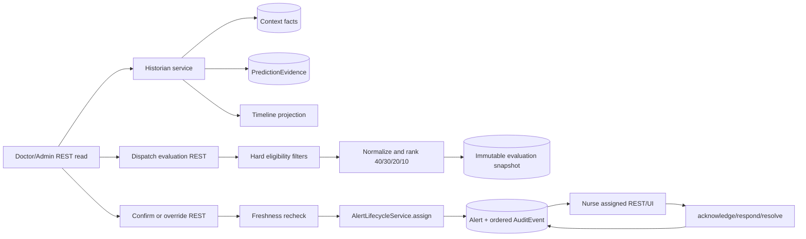

# Phase 4: Medical Historian and Human-Confirmed Dispatch - Research

**Researched:** 2026-08-25
**Domain:** Patient-context explanation, explainable dispatch, human-confirmed assignment, assignment-scoped nurse workflow
**Confidence:** HIGH for repository contracts; MEDIUM for domain policy details

## User Constraints (from CONTEXT.md)

### Locked Decisions
- **D-01:** Use an evidence timeline as the primary contextual-risk presentation, showing baseline score, patient facts, named research-rule deltas, and contextual score as a chronological evidence chain.
- **D-02:** Allow all seeded context categories, including diagnoses, medications, labs, and previous ICU events, to contribute through named configurable research rules.
- **D-03:** Doctors can add annotations, but annotations do not edit rules or alter computed scores. — **Reversibility:** costly — rationale: changing annotation semantics later would affect clinical-note persistence, timeline projections, and audit behavior.
- **D-04:** When context is incomplete, show baseline risk only, mark contextual risk unavailable, and identify the missing evidence rather than fabricating a partial score.
- **D-05:** Put rule mechanics in an expandable research-mode panel that shows each rule name, configurable delta, and rule version alongside an explicit non-clinical disclaimer.
- **D-06:** Attach Doctor annotations to the P-1042 patient timeline as timestamped entries with audit evidence.
- **D-07:** Show the complete seeded record without pagination in the first historian view.
- **D-08:** Both Admin and Doctor may confirm or override a nurse recommendation; Nurse users receive and act on the resulting assignment but do not commit staffing decisions.
- **D-09:** Confirmation and override require a reason plus an evidence snapshot containing actor, selected nurse, score breakdown, freshness, and the recommendation context.
- **D-10:** Present dispatch candidates as a ranked comparison with the recommended nurse first, alternatives afterward, component scores, eligibility reasons, workload, and distance.
- **D-11:** Require a fresh candidate/alert evidence snapshot before confirmation. If status, workload, or alert evidence is stale, block confirmation and require recomputation.
- **D-12:** Use an action-first assigned-alert view: risk, predicted event, latest vitals, bed, and acknowledgement action first, with relevant context expandable below.
- **D-13:** Require concise notes for response and resolution; acknowledgement remains a quick action without a note requirement.
- **D-14:** Show the assigned Nurse minimal relevant clinical context: current vitals, prediction evidence, key diagnoses, and prior events, not the complete Doctor historian record.
- **D-15:** Keep the Nurse on the patient timeline after response or resolution so the new state and audit entry are immediately visible.
- **D-16:** Represent no eligible nurse as a blocked assignment presentation while leaving the alert in `generated` and unassigned state.
- **D-17:** Show why every candidate was excluded and offer a human-triggered status refresh/recompute; never fabricate an assignment or auto-escalate it.
- **D-18:** Record a full exclusion snapshot with timestamp, alert evidence freshness, every candidate exclusion reason, and the retry actor.

### the agent's Discretion
- Exact visual styling, route/component names, API module decomposition, and persistence implementation details remain open to the standard patterns already established in the repository.

### Deferred Ideas (OUT OF SCOPE)
None — discussion stayed within Phase 4 scope.

## Phase Requirements

| ID | Description | Research Support |
|----|-------------|------------------|
| HIST-01 | Doctor retrieves demographics, admission, diagnoses, medications, labs, and previous ICU events | Historian read model and seeded context tables/DTO recommendations |
| HIST-02 | Baseline and contextual risk are separate and context is identified | Immutable prediction baseline plus evidence timeline |
| HIST-03 | Named configurable rule adjustments explain deltas and prototype status | Versioned rule-evaluation records and research-mode panel |
| HIST-04 | Doctor reviews clinical evidence without Admin controls or Nurse mutations | Doctor read policy and separate role views |
| HIST-05 | Chronological patient journey timeline | Unified timestamped projections from facts, predictions, annotations, alerts, dispatch, and lifecycle audit |
| DISP-01 | Ineligible nurses filtered before ranking | Hard eligibility filter with explicit exclusion reasons |
| DISP-02 | Transparent 40/30/20/10 weighted ranking | Deterministic normalized component scores and fixed weights |
| DISP-03 | Admin/Doctor inspect recommendation, alternatives, components, freshness, reasons | Evaluation snapshot read endpoint |
| DISP-04 | Human confirmation/override, never autonomous staffing | Confirm/override mutation delegates assignment to existing lifecycle and audit |
| DISP-05 | No-candidate result preserved without fabricated assignment | Persist blocked evaluation/exclusion snapshot; leave alert `generated` |
| NURS-01 | Assigned Nurse sees only assigned patients/alerts | Server-side assignment policy on each read |
| NURS-02 | Nurse acknowledge/respond/resolve | Existing lifecycle transition map, note rules, and action-first UI |
| NURS-03 | Unassigned Nurse cannot mutate or inspect outside scope | Apply assignment check to historian-minimal and alert/audit reads |

## Summary

AcuityNet is a modular FastAPI/SQLAlchemy monolith with React/TanStack Query presentation. The current persistence model has a single `History.summary`, a seeded P-1042 admission/bed/nurse, prediction evidence, alerts, alert events, and append-only audit events; therefore Phase 4 should add typed context and dispatch projections rather than overload `History.summary` or put scoring in the browser. [VERIFIED: backend/app/persistence/models.py:10-106; backend/app/seed/demo_data.py:30-59]

The phase should use one server-owned workflow: read prediction and patient context, evaluate completeness and named rules, produce an immutable historian explanation; evaluate nurse candidates with hard filters and fixed weighted ranking; require a fresh evaluation snapshot and Admin/Doctor reasoned confirmation or override; then invoke the existing `assign` lifecycle transition with assignment evidence containing the snapshot. Nurse actions remain the existing forward-only lifecycle and must be assignment-scoped. [VERIFIED: .planning/phases/04-medical-historian-and-human-confirmed-dispatch/04-CONTEXT.md; backend/app/alerts/lifecycle.py:8-72]

**Primary recommendation:** Add a typed Historian/Dispatch service boundary and REST routers, persist immutable evaluation/decision snapshots, preserve assignment evidence in existing audit details, and keep all role/resource checks server-side.

## Architectural Responsibility Map

| Capability | Primary Tier | Secondary Tier | Rationale |
|---|---|---|---|
| Historian facts and rule evaluation | API / Backend | Database / Storage | The backend owns patient context, prediction interpretation, and research-rule computation; storage supplies immutable source facts. [VERIFIED: .planning/PROJECT.md:35-46] |
| Timeline and annotations | API / Backend | Browser / Client | Timestamp ordering, actor authorization, and audit persistence are server responsibilities; React renders the projection. [VERIFIED: backend/app/audit/service.py:1-24; backend/app/audit/repository.py:17-27] |
| Candidate filtering and ranking | API / Backend | Database / Storage | Eligibility and score calculations must use current server data and cannot be trusted to a client. [VERIFIED: backend/app/auth/policy.py:20-35] |
| Confirmation/override and assignment | API / Backend | Database / Storage | Human decision, lifecycle state, and evidence are transactional audit mutations. [VERIFIED: backend/app/alerts/lifecycle.py:25-72] |
| Nurse assigned-work UI | Browser / Client | API / Backend | The client presents actions; the API enforces assignment ownership and lifecycle validity. [VERIFIED: backend/app/transport/alerts.py:8-59] |

## Standard Stack

### Core

| Library | Version | Purpose | Why Standard |
|---|---:|---|---|
| FastAPI | 0.141.1 | REST routers, dependencies, response models | Already pinned in backend project. [VERIFIED: backend/pyproject.toml:1-13] |
| Pydantic | 2.13.4 | Closed request/response contracts and validation | Already pinned and current contract style uses `extra="forbid"` and `Literal`. [VERIFIED: backend/pyproject.toml:5-8; backend/app/contracts/alerts.py:1-29] |
| SQLAlchemy | 2.0.52 | Persistence and transaction boundaries | Already pinned; current models use typed `Mapped`/`mapped_column`. [VERIFIED: backend/pyproject.toml:8; backend/app/persistence/models.py:1-18] |
| Alembic | 1.19.1 | Incremental schema migration | Already pinned and migrations are numbered `0001` through `0003`. [VERIFIED: backend/pyproject.toml:4; backend/app/migrations/versions/0003_monitoring_alerts_audit.py:1-10] |
| React | 19.2.8 | Role-specific workflow views | Already pinned in frontend. [VERIFIED: frontend/package.json:18-21] |
| TanStack Query | 5.102.2 | REST reads, invalidation, retry/error state | Existing App and AlertPage use query keys and REST fetchers. [VERIFIED: frontend/package.json:17; frontend/src/App.tsx:1-26; frontend/src/alerts/AlertPage.tsx:1-40] |
| Vitest + Testing Library | 4.1.11 / 16.3.2 | Focused frontend behavior tests | Existing frontend scripts and Phase 3 tests establish this path. [VERIFIED: frontend/package.json:6-16; .planning/phases/03-monitoring-alerts-lifecycle-and-audit/03-03-SUMMARY.md] |

### Supporting

No new external packages are required. Use Python `datetime`, JSON serialization already used by audit, SQLAlchemy queries, and native browser controls. [VERIFIED: backend/app/audit/repository.py:1-27; frontend/src/api/client.ts:1-60]

**Installation:** No package installation for this phase.

## Architecture Patterns

### System Architecture Diagram

### Recommended Data Model

Use normalized, patient-linked tables for the seeded facts, with typed fields and timestamps rather than one opaque summary. Exact table names are implementation discretion and should be finalized in the plan. [ASSUMED]

- `PatientContextFact`: patient ID, category (`diagnosis`, `medication`, `lab`, `icu_event`), concise display label/value, source/provenance, effective timestamp, and completeness status. Keep synthetic/research provenance explicit; do not add live MIMIC runtime data. [VERIFIED: .planning/PROJECT.md:8-12; .planning/REQUIREMENTS.md:13-15] [ASSUMED]
- `HistorianRuleEvaluation`: patient, prediction evidence ID, rule key/name, rule version, input fact IDs/category, delta, explanation, and evaluation timestamp. This is an explanation snapshot, not a clinical weight claim. [ASSUMED]
- `DispatchEvaluation`: alert/evidence IDs, created timestamp, alert freshness, candidate freshness, completeness status, ranked candidate JSON or child rows, selected recommendation, and no-candidate/exclusion outcome. Persist the exact evidence used so later confirmation cannot silently change history. [ASSUMED]
- `DispatchDecision`: alert ID, actor ID, decision (`confirmed`/`overridden`/`blocked`), reason, selected nurse, evaluation snapshot ID, timestamp, and decision evidence. A successful confirm/override must also be represented in the existing lifecycle assignment audit details. [VERIFIED: .planning/phases/04-medical-historian-and-human-confirmed-dispatch/04-CONTEXT.md; backend/app/alerts/lifecycle.py:43-64] [ASSUMED]
- `TimelineAnnotation`: patient ID, author ID, annotation text, timestamp, and source label. Only Doctors may create them; they never feed rule evaluation. [VERIFIED: .planning/phases/04-medical-historian-and-human-confirmed-dispatch/04-CONTEXT.md] [ASSUMED]

Return a single typed Historian response containing patient/admission/bed, current prediction, baseline score, `contextual_status`, contextual score only when complete, missing evidence, rule evaluations, annotations, alert evidence, and timeline. Return a separate DispatchEvaluation response containing snapshot ID, freshness, candidates, exclusions, weights, ranking, and prototype label. This avoids the current alert DTO becoming an unbounded clinical aggregate. [ASSUMED]

### Historian Read-Only Rule Explanation

1. Load the latest persisted prediction evidence and all complete seeded context categories.
2. Evaluate every configured named rule against a stable evidence snapshot; preserve rule key/version, input fact references, delta, and human-readable explanation.
3. If any required category is absent or stale, return baseline score and `contextual_status="incomplete"`, list missing evidence, and omit or null contextual score. Never sum a partial context set. [VERIFIED: .planning/phases/04-medical-historian-and-human-confirmed-dispatch/04-CONTEXT.md] [ASSUMED]
4. Build the timeline by merging timestamped facts, baseline prediction, rule deltas, contextual result, alert/lifecycle audit evidence, and Doctor annotations. Sort by timestamp plus stable database ID, matching the existing audit ordering rule. [VERIFIED: backend/app/audit/repository.py:17-27]
5. Expose rule mechanics only in an expandable research-mode panel and repeat the exact non-clinical prototype label on the historian surface. The current label is `Simulated ICU environment - research prototype - not for clinical use`. [VERIFIED: frontend/src/safety/PrototypeBanner.tsx:1-5]

Annotations use a dedicated POST endpoint and append an audit event with patient, author, annotation ID, and timestamp. The read model may display them in the timeline, but rule evaluation must not query annotations. [VERIFIED: .planning/phases/04-medical-historian-and-human-confirmed-dispatch/04-CONTEXT.md] [ASSUMED]

### Seeded Context and Rule Fixture

Seed one complete, synthetic P-1042 record so the happy path is deterministic and every HIST-01 category is represented: demographics from `Patient`, admission from `Admission`, bed from `Bed`, diagnoses, medications, labs, and previous ICU events as distinct `PatientContextFact` rows. Each fact should carry a stable ID, category, display label, value/unit where applicable, effective timestamp, source kind/name, and `is_complete=true`; use fictional values and the existing synthetic prototype label. [VERIFIED: backend/app/persistence/models.py:10-59; backend/app/seed/demo_data.py:30-59] [ASSUMED]

Use named, versioned rules with stable keys and explicit category requirements. A concrete fictional fixture for planning is: diagnosis `D-P1042-01` “fictional chronic respiratory condition”; medication `M-P1042-01` “fictional inhaled support”; lab `L-P1042-01` “oxygenation marker” value `92` unit `%`; and ICU event `E-P1042-01` “fictional prior respiratory observation”, all sourced as `synthetic` and dated before the current observation. Seed four rules, `diagnosis.respiratory_history` delta `0.05`, `medication.respiratory_support` delta `0.03`, `lab.oxygenation` delta `0.07`, and `icu_event.recent_deterioration` delta `0.05`, each with a plain-language explanation and version `rules.v1`; the contextual score is the baseline plus the four deltas, clamped to `[0,1]` only after complete evaluation. These values are implementation fixtures, not clinical facts or validated weights. [VERIFIED: .planning/STATE.md:39-43] [ASSUMED]

The complete response should contain all four categories, baseline score, contextual score, named evaluations, missing evidence as an empty list, annotations, alert/lifecycle evidence, and a timeline. For a missing category, return the same record with `contextual_status="incomplete"`, `contextual_score=null`, no partial deltas applied, and `missing_evidence` naming the category/rules that could not be evaluated. This makes the baseline-only behavior testable without manufacturing a score. [VERIFIED: .planning/phases/04-medical-historian-and-human-confirmed-dispatch/04-CONTEXT.md]

### REST Contract Shape

Keep REST authoritative and use closed Pydantic DTOs with `extra="forbid"`, bounded text, and literal roles/actions, matching the current alert contracts. [VERIFIED: backend/app/contracts/alerts.py:1-29; .planning/phases/03-monitoring-alerts-lifecycle-and-audit/03-03-SUMMARY.md]

| Endpoint | Access | Request | Response / behavior |
|---|---|---|---|
| `GET /api/v1/patients/{patient_id}/historian` | Doctor/Admin; Nurse only through assignment-scoped minimal view | None | Full `HistorianResponse`: patient/admission/bed, current prediction, baseline/contextual status and score, facts, named rule evaluations, missing evidence, annotations, alert evidence, ordered timeline, provenance, prototype label. |
| `POST /api/v1/patients/{patient_id}/annotations` | Doctor only | `{text}` with concise bounded text | Created annotation with author/time; append `annotation.created` audit evidence; never recompute or alter scores. |
| `GET /api/v1/patients/{patient_id}/dispatch/evaluation` | Doctor/Admin | Optional `retry=true` only on explicit human action | New immutable evaluation snapshot: snapshot ID, alert/evidence IDs, freshness, weights, ranked eligible candidates, all exclusions, recommendation, blocked/no-candidate status, prototype label. Evaluation alone never assigns. |
| `POST /api/v1/patients/{patient_id}/dispatch/retry` | Doctor/Admin | None | Recompute evaluation, record retry actor/time and full exclusion snapshot; leave generated/unassigned when blocked. |
| `POST /api/v1/patients/{patient_id}/dispatch/confirm` | Doctor/Admin | `{evaluation_id, nurse_id, reason}` | Freshness recheck, then decision snapshot plus existing `lifecycle.assign`; return assigned alert. Stale/invalid evidence returns conflict and creates no assignment. |
| `POST /api/v1/patients/{patient_id}/dispatch/override` | Doctor/Admin | `{evaluation_id, nurse_id, reason}` | Same transaction and freshness rules as confirm, with decision type `override`; selected nurse must still be eligible. |
| `GET /api/v1/patients/{patient_id}/nurse-work` | Assigned Nurse only | None | Minimal action-first response: alert, risk/event, latest vitals, bed, key diagnoses, prior ICU events, assignment, allowed actions, timeline. Never accept nurse ID from the client. |
| Existing `POST .../alert/lifecycle` | Admin/Doctor assign; assigned Nurse acknowledge/respond/resolve | Existing `AlertLifecycleCommand` | Reuse the existing transition map and note requirements; do not create a second lifecycle route. [VERIFIED: backend/app/alerts/lifecycle.py:8-72] |

Use `403` for role/resource/assignment denial, `404` for unavailable patient/alert/snapshot, `409` for stale evaluation or changed candidate state, and `422` for malformed or invalid transition input, consistent with existing route handling. Denied requests must continue through the shared denial audit boundary and must not disclose other candidates or credentials. [VERIFIED: backend/app/main.py:47-67; backend/app/transport/alerts.py:35-58]

### Dispatch Ranking

Apply hard eligibility before any weighted score. For each candidate, capture eligibility as a structured list, not only a boolean. At minimum, reject inactive/unmapped nurses, `available=false`, and stale status; reject a candidate without a usable nurse/assignment identity. Do not invent live proximity or workload: use seeded/configured prototype values or mark the component unavailable and block confirmation. [VERIFIED: backend/app/persistence/models.py:37-49; .planning/REQUIREMENTS.md:51-56] [ASSUMED]

For eligible candidates, normalize each component to `[0, 1]` where higher is better, then compute the transparent prototype score:

$$dispatch = 0.40A + 0.30P + 0.20W + 0.10C$$

where $A$ is availability, $P$ proximity, $W$ workload capacity, and $C$ acuity compatibility. The weights are project-locked and are not validated clinical or staffing weights. [VERIFIED: .planning/PROJECT.md:43-46; .planning/REQUIREMENTS.md:53-54]

Persist/display the raw input, normalized component, weight, contribution, total, rank, freshness timestamp, and exclusion reasons. Use deterministic tie-breaking in this exact order: total descending, availability component descending, proximity component descending, workload component descending, acuity compatibility component descending, then `nurse_id` ascending. Do not use database row order or display name as an implicit tie-break. [ASSUMED]

Before confirmation, reload the alert, latest prediction evidence, nurse status/workload/proximity source, and evaluation snapshot in one transaction. Compare freshness/version identifiers. A mismatch or stale source returns a typed conflict/stale response and creates no assignment. [VERIFIED: .planning/phases/04-medical-historian-and-human-confirmed-dispatch/04-CONTEXT.md] [ASSUMED]

### Human Confirmation and Override

Expose separate mutations such as `POST /api/v1/patients/{patient_id}/alert/dispatch/confirm` and `/override`, each with a reason and snapshot ID. The service must authorize only Admin/Doctor, validate the snapshot freshness and selected candidate, then call `AlertLifecycleService.transition` with `action="assign"`, `assignment_id`, and an assignment evidence string or compact JSON reference. The existing service already requires Admin/Doctor assignment, `N-SARAH`, and assignment evidence, and writes `lifecycle.assign` audit details. [VERIFIED: backend/app/alerts/lifecycle.py:25-64]

The assignment evidence should include or reference actor, selected nurse, rank, all score components/weights, candidate and alert freshness, snapshot ID, recommendation context, decision type, and reason. Keep it bounded to the existing 1000-character audit detail column by storing a full immutable snapshot separately and putting a stable snapshot ID plus summary in audit details. Do not include tokens, passwords, or unnecessary patient data. [VERIFIED: backend/app/persistence/models.py:86-96; .planning/phases/03-monitoring-alerts-lifecycle-and-audit/03-02-SUMMARY.md] [ASSUMED]

Confirmation is not an autonomous staffing command: no assignment occurs on evaluation, no-candidate, stale, or denied paths. Override still requires a valid eligible selection, explicit reason, fresh snapshot, and audit evidence. [VERIFIED: .planning/phases/04-medical-historian-and-human-confirmed-dispatch/04-CONTEXT.md]

The full decision snapshot should preserve `decision_id`, evaluation ID, alert ID, actor ID, decision type (`confirmed` or `overridden`), selected nurse, reason, candidate rank, raw and normalized score components, weights, alert/candidate freshness timestamps or version IDs, and recommendation context. Store the full JSON snapshot in a dedicated bounded/structured persistence row; put only the snapshot ID, decision type, selected nurse, and compact reason/reference in the existing `AuditEvent.details`, because that column is currently `String(1000)`. The successful lifecycle assignment must retain `assignment_id` and assignment evidence in audit details so Phase 3 reconstruction remains compatible. [VERIFIED: backend/app/persistence/models.py:86-96; .planning/phases/03-monitoring-alerts-lifecycle-and-audit/03-02-SUMMARY.md]

### No-Candidate and Retry Flow

Return `blocked`/`no_eligible_candidate` with alert state still `generated`, `assignment_id=null`, full candidate exclusion list, alert/evaluation freshness, and no lifecycle assignment event. A retry is a human-triggered recompute endpoint, not a background escalation; record retry actor and timestamp in the exclusion snapshot/audit event. [VERIFIED: .planning/phases/04-medical-historian-and-human-confirmed-dispatch/04-CONTEXT.md; backend/app/contracts/alerts.py:31-68] [ASSUMED]

The UI should render every exclusion reason, a visible stale/no-candidate state, and a refresh/recompute button available only to Admin/Doctor. Disable confirm when no candidate or stale data exists. Avoid presenting an empty recommendation as a successful dispatch. [VERIFIED: frontend/src/alerts/AlertPage.tsx:18-37; .planning/phases/03-monitoring-alerts-lifecycle-and-audit/03-03-SUMMARY.md] [ASSUMED]

For deterministic tests, seed at least the Sarah candidate tied to `N-SARAH` with `available=true`, a current status timestamp, prototype distance/workload/acuity inputs, and a second candidate only in test fixtures when exercising alternatives or exclusion. Production/demo seed must remain exactly the three accounts and must not fabricate an alert, assignment, candidate decision, or retry artifact; candidate operational rows may be seeded as neutral prototype inputs, while the alert is still generated only by the Phase 3 deterioration journey. [VERIFIED: .planning/phases/03-monitoring-alerts-lifecycle-and-audit/03-04-SUMMARY.md; backend/app/seed/demo_data.py:8-59] [ASSUMED]

### Assignment-Scoped Nurse Workflow

Add Nurse reads that first locate the current active alert and derive assignment from successful lifecycle audit evidence, preserving the Phase 3 compatibility rule. Do not rely on a client-supplied nurse ID. Apply `require_patient_access` and `require_nurse_assignment`, then require the successful assignment evidence check for every historian-minimal, alert, timeline, and audit read. [VERIFIED: backend/app/auth/policy.py:20-35; backend/app/transport/alerts.py:8-28; backend/app/transport/audit.py:10-22; .planning/phases/03-monitoring-alerts-lifecycle-and-audit/03-02-SUMMARY.md]

The Nurse response should contain only assigned patient, bed, current vitals, prediction evidence, key diagnoses, prior events, current alert, and allowed actions. Use the existing lifecycle endpoint for acknowledge/respond/resolve; acknowledgement has no note requirement, while response and resolution require a concise note. [VERIFIED: backend/app/alerts/lifecycle.py:45-50; .planning/phases/04-medical-historian-and-human-confirmed-dispatch/04-CONTEXT.md]

The frontend should extend the role dashboard composition in `App.tsx`, add typed client functions/contracts, and keep the Nurse on the timeline after mutation by invalidating/refetching REST queries. WebSockets may invalidate but never authorize or become the read source. [VERIFIED: frontend/src/App.tsx:1-26; frontend/src/api/client.ts:20-60; .planning/phases/03-monitoring-alerts-lifecycle-and-audit/03-03-SUMMARY.md]

## Don't Hand-Roll

| Problem | Don't Build | Use Instead | Why |
|---|---|---|---|
| Lifecycle transitions | A second assignment state machine | Existing `AlertLifecycleService` | It owns the closed transition map, notes, role checks, audit, and publisher behavior. [VERIFIED: backend/app/alerts/lifecycle.py:8-72] |
| Authorization | UI-only role hiding or client nurse IDs | FastAPI dependencies plus current policy and server-derived assignment | Existing Phase 3 tests prove hidden navigation is insufficient and Nurse scope must be enforced in transport. [VERIFIED: backend/app/auth/policy.py:1-35; .planning/phases/03-monitoring-alerts-lifecycle-and-audit/03-02-SUMMARY.md] |
| Audit ordering | A separate timeline clock or mutable history | `AuditRepository` timestamp + audit ID ordering and structured JSON details | Existing audit projection already defines deterministic ordering. [VERIFIED: backend/app/audit/repository.py:17-27] |
| Global staffing optimization | Hungarian/global optimizer | Single-patient deterministic weighted ranking | Global optimization is explicitly v2/out of scope. [VERIFIED: .planning/REQUIREMENTS.md:74-76] |
| Clinical risk validation | Claims about medical weights or treatment | Configurable research rules with prototype labeling | The project explicitly excludes validated clinical weights and advice. [VERIFIED: .planning/PROJECT.md:8-12; .planning/REQUIREMENTS.md:74-77] |

## Common Pitfalls

### Incomplete context accidentally becomes a clinical-looking score
**What goes wrong:** A missing diagnosis, medication, lab, or prior event silently contributes zero and the UI calls the result contextual risk. **Prevention:** completeness gate; baseline-only response with missing evidence and `contextual_status` unavailable. [VERIFIED: .planning/phases/04-medical-historian-and-human-confirmed-dispatch/04-CONTEXT.md] [ASSUMED]

### Candidate freshness checked only when listing
**What goes wrong:** A nurse becomes unavailable after ranking but before confirmation. **Prevention:** snapshot IDs/timestamps and transactional freshness recheck immediately before assignment. [VERIFIED: .planning/phases/04-medical-historian-and-human-confirmed-dispatch/04-CONTEXT.md] [ASSUMED]

### Assignment evidence is too large or loses the existing audit contract
**What goes wrong:** Full JSON exceeds `AuditEvent.details` capacity or a new assignment table makes existing reconstruction disagree. **Prevention:** immutable snapshot table plus bounded audit reference/summary; continue deriving current assignment from successful `lifecycle.assign`. [VERIFIED: backend/app/persistence/models.py:86-96; .planning/phases/03-monitoring-alerts-lifecycle-and-audit/03-02-SUMMARY.md] [ASSUMED]

### No-candidate becomes silent escalation or fabricated assignment
**What goes wrong:** Empty candidate list is shown as success or background code changes alert state. **Prevention:** blocked generated/unassigned state, all exclusion reasons, explicit retry actor, no autonomous escalation. [VERIFIED: .planning/phases/04-medical-historian-and-human-confirmed-dispatch/04-CONTEXT.md]

### Nurse data overexposure
**What goes wrong:** Nurse receives complete Doctor historian record or can query arbitrary patient IDs. **Prevention:** dedicated minimal response and repeated server-side assignment checks on every route. [VERIFIED: .planning/PROJECT.md:44-46; backend/app/auth/policy.py:20-35] [ASSUMED]

### Research prototype label disappears on secondary views
**What goes wrong:** Historian or dispatch score looks like validated clinical/staffing authority. **Prevention:** shared `PrototypeBanner`, source/provenance metadata, and explicit research-rule/weighted-prototype text on each surface. [VERIFIED: frontend/src/safety/PrototypeBanner.tsx:1-5; .planning/PROJECT.md:35-46]

### Accessibility turns expandable evidence into a mouse-only control
**What goes wrong:** Rule details or action states cannot be reached/read by keyboard or assistive technology. **Prevention:** native headings, lists, tables, buttons, and `
/
` where suitable; visible focus, labels, status announcements, and no color-only state. [CITED: https://www.w3.org/WAI/WCAG22/quickref/]

## Migration Strategy

Add one Alembic revision after `0003_monitoring_alerts_audit`; keep `migrate_database()` authoritative and do not use `create_all()`. [VERIFIED: backend/app/persistence/database.py:15-25; backend/app/migrations/versions/0003_monitoring_alerts_audit.py:1-10] [ASSUMED]

Create new tables with foreign keys to patients/users/alerts/prediction evidence as applicable, indexes for patient/timestamp and alert/snapshot lookup, and bounded string/JSON columns consistent with the current SQLite-first PostgreSQL path. Add a downgrade that drops indexes/tables in reverse dependency order. [VERIFIED: backend/app/migrations/versions/0001_phase1_foundation.py:12-28; backend/app/migrations/versions/0003_monitoring_alerts_audit.py:14-30] [ASSUMED]

Update `reset_demo_data()` to delete Phase 4 children first: annotations, rule evaluations, dispatch decisions, candidate/evaluation snapshots, then Phase 3 audit/alert children and parents in the established order. Reset remains separate from migration and reseed; seed exactly the existing three demo accounts and deterministic P-1042 context, candidate fixture values, and rules. [VERIFIED: backend/app/seed/reset.py:14-31; backend/app/seed/demo_data.py:8-59; .planning/phases/03-monitoring-alerts-lifecycle-and-audit/03-04-SUMMARY.md] [ASSUMED]

Do not store dispatch candidate availability as an unbounded live truth. Seed deterministic prototype candidate inputs and label them as simulation/configuration; if required inputs are absent, produce an excluded/unavailable reason and block confirmation. [VERIFIED: .planning/PROJECT.md:8-12; .planning/REQUIREMENTS.md:74-77] [ASSUMED]

Recommended additive tables are: `patient_context_facts`; `historian_rule_definitions` (or configuration-backed definitions if the project keeps rules in `Configuration`); `historian_rule_evaluations`; `timeline_annotations`; `dispatch_evaluations`; `dispatch_candidates` (eligible and excluded rows); and `dispatch_decisions`. Link evaluations to `patient_id` and `evidence_id`, decisions to `alert_id` and evaluation ID, and annotations to patient/user. Store structured candidate score data and exclusion reasons as JSON with bounded text summaries, and index `(patient_id, effective_at)`, `(patient_id, evaluation_id)`, and `(alert_id, created_at)`. Preserve PostgreSQL portability by avoiding SQLite-specific JSON behavior in rule logic and by keeping timestamps timezone-aware. [VERIFIED: backend/app/persistence/models.py:1-106; backend/app/migrations/versions/0001_phase1_foundation.py:12-28; backend/app/migrations/versions/0003_monitoring_alerts_audit.py:14-30] [ASSUMED]

Reset order must be: annotations, decisions, dispatch candidates, dispatch evaluations, historian rule evaluations, context facts, then existing `AlertEvent`, `AuditEvent`, `Alert`, `PredictionEvidence`, `VitalObservation`, and Phase 1 parent rows. Reseed must restore the complete context/rule/candidate fixture but no alert or assignment. Add migration inspection and foreign-key reset assertions alongside the existing Phase 3 migration test. [VERIFIED: backend/app/seed/reset.py:14-31; backend/tests/test_phase3_migration.py:25-83] [ASSUMED]

## Validation Architecture

Nyquist validation is explicitly disabled in `.planning/config.json`, so no formal Nyquist section is required. The following focused verification is still recommended for Phase 4. [VERIFIED: .planning/config.json:1-20]

### Backend checks

- `python -m pytest backend/tests/test_phase3_integration.py backend/tests/test_lifecycle_audit.py backend/tests/test_alerts.py -q` establishes the regression baseline for lifecycle, assignment evidence, and audit ordering. [VERIFIED: .planning/phases/03-monitoring-alerts-lifecycle-and-audit/03-04-SUMMARY.md]
- Add focused tests for: complete Historian DTO and all four context categories; baseline-only incomplete context; annotation persistence, Doctor-only creation, score immutability, and audit evidence; deterministic 40/30/20/10 ranking and tie-break; hard exclusion reasons; stale snapshot conflict; Admin/Doctor confirm and override reason/evidence; no-candidate generated/unassigned retry; assigned Sarah Nurse read/actions; unassigned Nurse read/mutation denial; and audit detail secret bounds. [ASSUMED]
- Add migration/reset tests that upgrade a fresh SQLite database, inspect all Phase 4 tables/indexes, insert dependent rows, reset in foreign-key-safe order, reseed, and assert exactly three seeded users plus no alert/assignment/decision artifacts. [VERIFIED: backend/tests/test_phase3_migration.py:10-83; backend/app/seed/reset.py:14-31] [ASSUMED]
- Run `python scripts/phase3_smoke.py` with a local `ACUITYNET_JWT_SECRET` as the pre-existing clean journey gate, then add a Phase 4 smoke script or extend it only with temporary database isolation and secret-safe output. [VERIFIED: README.md:45-74; .planning/phases/03-monitoring-alerts-lifecycle-and-audit/03-04-SUMMARY.md]

### Frontend checks

- `npm --prefix frontend run test -- --run` runs the existing Vitest suite; add focused tests for Doctor evidence timeline/rule disclosure, baseline-only state, annotation validation, dispatch comparison/freshness/no-candidate states, confirmation/override reason requirements, Nurse assignment-only rendering, lifecycle buttons/notes, REST refetch after mutation, and prototype labels. [VERIFIED: frontend/package.json:6-16; .planning/phases/03-monitoring-alerts-lifecycle-and-audit/03-03-SUMMARY.md] [ASSUMED]
- `npm --prefix frontend run lint` is the narrow TypeScript check. `npm --prefix frontend run build` remains useful but has a known pre-existing `PredictionPage.tsx` strict-null blocker recorded by Phase 3; distinguish that baseline failure from Phase 4 diagnostics. [VERIFIED: .planning/phases/03-monitoring-alerts-lifecycle-and-audit/03-03-SUMMARY.md]
- Manual keyboard check: tab through evidence disclosure, candidate rows, reason fields, confirm/override/retry, and Nurse actions; verify visible focus, semantic labels, status text, and no color-only meaning. [CITED: https://www.w3.org/WAI/WCAG22/quickref/]

### Acceptance journey

Use temporary SQLite and seeded accounts. Admin advances deterministic P-1042 deterioration; Doctor reads historian, sees baseline/context explanation, adds annotation, evaluates candidates, confirms or overrides with a reason; Sarah sees only assigned P-1042, acknowledges, responds with concise note, and resolves; Doctor reconstructs timeline/audit; a second Nurse fixture is denied. Assert no assignment on evaluation/no-candidate/stale confirmation and assert all evidence remains ordered. [VERIFIED: backend/tests/test_phase3_integration.py:17-93; .planning/REQUIREMENTS.md:87-93] [ASSUMED]

## Security Domain

The phase handles patient-like clinical context, staffing availability/workload, role actions, and audit evidence; access control and input validation are mandatory even though the dataset is synthetic. [VERIFIED: .planning/PROJECT.md:35-46; .planning/REQUIREMENTS.md:5-10]

| ASVS Category | Applies | Standard Control |
|---|---|---|
| V2 Authentication | Yes | Reuse JWT dependency `current_user`; reject missing/invalid bearer sessions. [VERIFIED: backend/app/auth/policy.py:1-17] |
| V3 Session Management | Yes | Do not put tokens in persisted snapshots/audit details; preserve current denial recorder behavior. [VERIFIED: backend/app/main.py:47-67; backend/tests/test_phase3_integration.py:75-93] |
| V4 Access Control | Yes | Enforce Admin/Doctor confirmation, Doctor annotation, and Nurse assignment scope in API services/routes, not navigation. [VERIFIED: backend/app/auth/policy.py:20-35; .planning/REQUIREMENTS.md:5-10] |
| V5 Input Validation | Yes | Pydantic `extra="forbid"`, bounded reason/note/text fields, closed decision/action literals, candidate/snapshot ownership checks. [VERIFIED: backend/app/contracts/alerts.py:11-29] |
| V6 Cryptography | Yes | Reuse existing JWT/password implementation; do not add custom cryptography or persist credentials. [VERIFIED: backend/pyproject.toml:4-8; backend/app/seed/demo_data.py:11-15] |
| V7 Error Handling and Logging | Yes | Return typed 403/404/409/422 outcomes without leaking other patients/candidates; append denied actions through existing audit boundary. [VERIFIED: backend/app/main.py:47-67; backend/app/audit/service.py:8-24] |

### Threat patterns

| Pattern | STRIDE | Mitigation |
|---|---|---|
| Nurse changes patient ID or candidate ID | Elevation/Tampering | Derive assignment and candidate ownership server-side; recheck policy and snapshot. [VERIFIED: backend/app/auth/policy.py:20-35] |
| Stale recommendation confirmed | Tampering | Compare snapshot, alert evidence, and candidate freshness in transaction; return conflict and no assignment. [VERIFIED: .planning/phases/04-medical-historian-and-human-confirmed-dispatch/04-CONTEXT.md] [ASSUMED] |
| Audit evidence leaks secrets or excessive context | Information disclosure | Bounded structured details, snapshot references, tests forbidding password/bearer/authorization strings. [VERIFIED: backend/tests/test_phase3_integration.py:80-93] |
| Prototype score interpreted as clinical/staffing command | Spoofing/Repudiation | Repeat non-clinical label, source/rule versions, human decision actor/reason, and no autonomous path. [VERIFIED: .planning/PROJECT.md:8-12; .planning/REQUIREMENTS.md:74-77] |

## Assumptions Log

| # | Claim | Section | Risk if Wrong |
|---|---|---|---|
| A1 | Normalized candidate inputs can be seeded/configured for proximity, workload, and acuity compatibility in v1. | Dispatch Ranking | Ranking cannot be deterministic or confirmation-ready without a product decision on fixture inputs. |
| A2 | Separate normalized context and snapshot tables are acceptable instead of extending `History`. | Recommended Data Model | Migration and seed scope changes if the project requires a single JSON/blob model. |
| A3 | A bounded audit summary plus immutable snapshot ID satisfies evidence review. | Human Confirmation | Audit UI may need a larger details contract or denormalized evidence. |
| A4 | Timestamp plus stable database ID is sufficient timeline tie-breaking for new event types. | Historian | A dedicated sequence may be needed if cross-table clock collisions must preserve causal order. |
| A5 | HTTP 409 is acceptable for stale confirmation conflicts and typed blocked states. | Dispatch Confirmation | Existing API error conventions may require a different response contract. |
| A6 | No new package is needed for accessibility or ranking. | Standard Stack | Package installation would require a new legitimacy audit. |

## Open Questions (RESOLVED)

1. **Deterministic fixtures:** Seed the complete fictional P-1042 context as diagnosis `D-P1042-01` = “fictional chronic respiratory condition”, medication `M-P1042-01` = “fictional inhaled support”, lab `L-P1042-01` = oxygenation marker `92 %`, and ICU event `E-P1042-01` = “fictional prior respiratory observation”. Seed four `rules.v1` rules: `diagnosis.respiratory_history` `+0.05`, `medication.respiratory_support` `+0.03`, `lab.oxygenation` `+0.07`, and `icu_event.recent_deterioration` `+0.05`. Every category contributes through its named rule; contextual score is baseline plus all four deltas and is clamped to `[0,1]` only after complete evaluation. Seed Sarah as the happy-path candidate with availability `1.00`, normalized proximity `0.90`, workload capacity `0.80`, and acuity compatibility `1.00`; use raw distance `1.2 km`, workload `1 active / 4 capacity`, and acuity value `ICU-compatible`. A second candidate and exclusion variants belong only to isolated tests. These are stable fictional fixtures with synthetic provenance and make no clinical validity claim.
2. **Freshness windows:** Add prototype configuration keys `historian_context_fresh_seconds=86400`, `dispatch_status_fresh_seconds=60`, `dispatch_workload_fresh_seconds=60`, `dispatch_proximity_fresh_seconds=300`, and `dispatch_alert_fresh_seconds=300`. Context facts older than 24 hours and any candidate/alert source older than its named window are stale. Confirmation must re-read all sources transactionally; any stale or changed status, workload, proximity, alert, or snapshot returns typed `409` conflict, creates no assignment, and requires human recomputation.
3. **Audit action shape:** Use separate `confirm` and `override` REST mutations and a single typed persisted `DispatchDecision` shape with `decision_type` set to `confirmed` or `overridden`. Both decisions must retain the existing `lifecycle.assign` action, `assignment_id`, and a bounded audit detail containing the immutable snapshot ID, decision type, selected nurse, and compact reason. Full evidence remains in the immutable decision/evaluation snapshot.
4. **Missing operational inputs:** Required candidate inputs are availability/status freshness, workload, proximity, acuity compatibility, and stable nurse/assignment identity. Missing any required input always excludes the candidate with a named reason, produces no score for that candidate, and can result in `no_eligible_candidate`; no score, assignment, escalation, or fabricated value is permitted.
5. **Route ownership:** The full Doctor historian is `/historian` rendered by `HistorianPage` from `DoctorDashboardView`; Admin may access the same protected read but does not gain Doctor annotation controls. Dispatch review is an `AdminDashboardView` section and a Doctor dashboard section using shared `DispatchPage`; both call the protected dispatch routes. Nurse work is `/nurse-work` rendered by `NurseDashboardView` and is assignment-derived. `App.tsx` remains the role composition point and no additional role is introduced.

## Project Constraints (from copilot-instructions.md)

- Use GSD only when explicitly requested; this research request explicitly invokes the Phase 4 research workflow. [VERIFIED: .github/copilot-instructions.md:2-7]
- Treat exactly three roles and the existing project boundaries as locked; do not recommend additional roles or autonomous staffing. [VERIFIED: .planning/PROJECT.md:35-46; .planning/REQUIREMENTS.md:74-77]
- Research-only deliverable: do not modify application code. [VERIFIED: user request]

## Environment Availability

| Dependency | Required By | Available | Version | Fallback |
|---|---|---|---|---|
| Python | Backend tests/migrations | ✓ | Project requires >=3.13 | — [VERIFIED: backend/pyproject.toml:1-4] |
| Node/npm | Frontend tests/typecheck | ✓ | Frontend package scripts available | Existing installed dependencies required; Phase 3 notes build/lint environment blockers. [VERIFIED: frontend/package.json:6-16; .planning/STATE.md:42-43] |
| SQLite | Migration/integration journey | ✓ | SQLite-first project path | — [VERIFIED: backend/app/persistence/database.py:8-25] |
| External service | Phase 4 | Not required | — | Keep synthetic fixtures and local SQLite. [VERIFIED: .planning/PROJECT.md:8-12] |

## Sources

### Primary (HIGH confidence)
- `.planning/PROJECT.md`, `.planning/REQUIREMENTS.md`, `.planning/ROADMAP.md`, `.planning/STATE.md`, and `04-CONTEXT.md` — locked scope, requirements, decisions, and known gaps.
- `backend/app/persistence/models.py`, `main.py`, `auth/policy.py`, `alerts/lifecycle.py`, `audit/service.py`, `transport/alerts.py`, `transport/audit.py` — current persistence, wiring, authorization, lifecycle, and audit boundaries.
- `backend/app/seed/demo_data.py`, `seed/reset.py`, migrations `0001`-`0003`, and Phase 3 integration/migration tests — deterministic fixture and migration patterns.
- `frontend/src/App.tsx`, `api/client.ts`, `alerts/AlertPage.tsx`, `safety/PrototypeBanner.tsx`, and `frontend/package.json` — current client composition, REST authority, safety presentation, and test/build commands.

### Secondary (MEDIUM confidence)
- `.planning/research/SUMMARY.md` — project architecture and risk synthesis from prior research.
- Phase 3 summaries `03-02-SUMMARY.md`, `03-03-SUMMARY.md`, and `03-04-SUMMARY.md` — implementation decisions and verification evidence.

### Tertiary (LOW confidence)
- None used for implementation facts. Accessibility guidance is cited to WCAG Quick Reference but was not retrievable through the available page fetcher in this session. [CITED: https://www.w3.org/WAI/WCAG22/quickref/]

## Metadata

**Confidence breakdown:**
- Standard stack: HIGH — all packages and versions are present in the opened project manifests.
- Architecture: HIGH — ownership and compatibility are directly established by current routes, services, models, and Phase 3 summaries.
- Historian/dispatch domain details: MEDIUM — locked behavior is clear, but exact seed values and freshness policy remain open.
- Security/accessibility: MEDIUM — repository controls are concrete; domain privacy policy and external standards validation remain limited.

**Research date:** 2026-08-25
**Valid until:** 2026-09-24 for stable repository contracts; revalidate fast-moving package versions before installation (none recommended here).
